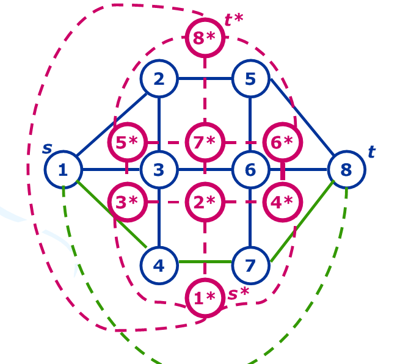

# 算法总结

## I.数论、数学

### 同余与不定方程

#### 1.扩展欧几里得算法

##### 代码模板

```c++
int Exgcd(int a,int b,int &x,int &y){
	if (b){int q=Exgcd(b,a%b,y,x); return y-=a/b*x,q;}
		else return x=1,y=0,a;
}
```

##### 用途

解同余方程：$ax+by=c$

解出一组解当且仅当：$(a,b)|c$ 时有解

$x_0=x*\dfrac{c}{(a,b)}$

$y_0=y*\dfrac{c}{(a,b)}$

##### 通解

$x=x_0+\dfrac{kb}{(a,b)}(k\in Z)$

$y=y_0-\dfrac{ka}{(a,b)}(k\in Z)$

##### 套路

求解：$ax+b \equiv cx+d({\rm mod}\ p)$，可转化为$(a-c)x+py=d-b$

#### 2.扩展中国剩余定理

##### 代码模板

```c++
read(N),read(Mod),read(Ans);
for (int i=1;i<N;++i){
	read(A),read(B),_a=Mod,_b=A;
	if ((_c=B-Ans%A)<0) _c+=A;
	dv=Exgcd(_a,_b,x,y),bg=_b/dv,x=Mul(x,_c/dv,bg),Ans+=x*Mod,Mod*=bg;
	if ((Ans%=Mod)<0) Ans+=Mod;
}
```

##### 用途

求解同余方程组：

$\begin{cases} x \equiv b_1\ ({\rm mod}\ a_1) \\ x\equiv b_2\ ({\rm mod}\ a_2) \\ ... \\ x \equiv b_n\ ({\rm mod}\ a_n)\end{cases}$

##### 简略推导

使用数学归纳法，如果我们已经知道了前$k-1$个方程组构成的一个解，记作$x$。

记$m=\Pi_{i=1}^{k-1}b_i$，则$x+i\times m(i∈Z)$是前$k-1$个方程的通解。

考虑对于第$k$个方程，求出一个$t$，使得$x+t*m≡a_i\pmod {b_i}$。

然后$x′=x+t\times m$。

综上，循环$n$次即可。

##### 注意事项

如果模数的最小公倍数的平方超出了$64$位整数，记得写快速乘！

#### 3.BSGS和扩展BSGS

##### 代码模板

```c++
std::map<int,int> F;
inline void Ex_Bsgs(int A,int B,int P){
	if (B==1) return (void)puts("0");
	int k=0,t=1,Mul,M,A_M;
	for (int d;;){
		if ((d=gcd(A,P))==1) break;
		if (B%d) return (void)puts("No Solution");
		if (B/=d,P/=d,++k,(t=(ll)t*(A/d)%P)==B) return (void)printf("%d\n",k);
	}
	F.clear(),F[Mul=B]=0,M=ceil(sqrt(P+0.5)),A_M=Power(A,M,P);
	for (int j=1;j<=M;++j) F[Mul=(ll)Mul*A%P]=j;
	//F[Mul]应该采用最大的j
	Mul=t;
	for (int j=1;j<=M;++j) if (F.count(Mul=(ll)Mul*A_M%P))
		return (void)printf("%d\n",j*M-F[Mul]+k);
	puts("No Solution");
}
```

##### 用途

求解同余方程$A^x \equiv B\ ({\rm mod}\ p)$

##### 简略推导（原版）

令$M=\sqrt{p}$（向上取整），设$x=kM+b$，$b\in[0,y)\bigcap{\rm N^*}$

我们将每个$A^b{\rm mod}\ p$存入哈希表

$k>0$，原式等价于：

$(A^M)^kA^b \equiv B\ ({\rm mod}\ p)$

$A^b \equiv ((A^M)^k)^{-1}B\ ({\rm mod}\ p)$

由于上面用的是**j\*M-F[Mul]+k**，所以减法用不着求逆元

##### 扩展

设$d=(A,p)$，根据同余，$A^{x-1}\dfrac{A}{d}\equiv\dfrac{B}{d}\ ({\rm mod}\ \dfrac{p}{d})$，再设$g=\dfrac{G}{A}$，不难看出：$A^{x-1}=\dfrac{Bg}{d}\ ({\rm mod}\ \dfrac{p}{d})$

然后当$(A,p)∤B$并且$B\neq1$时无自然数解

### 组合数学

#### 4.Lucas定理及其扩展

##### 定理

$C^m_n\equiv C^{m\ ({\rm mod\ p})}_{n\ ({\rm mod\ p})}\times C^{⌊m/p⌋}_{⌊n/p⌋}\ ({\rm mod\ p})$

##### 扩展

原版只能处理$p$是质数，但是如果将$p$拆成若干个质因子相乘的形式就可以用中国剩余定理合并$Lucas$了

##### 代码模板

```c++
inline int C(int N,int M,int p){return M>N?0:Fac[N]*inv[M]%p*inv[N-M]%p;}
inline int Lucas(int N,int M,int p){
	if (!M) return 1;
	if (M>N) return 0;
	return (ll)C(N%p,M%p,p)*Lucas(N/p,M/p,p)%p;
}
void Exgcd(int a,int b,int &x,int &y){b?Exgcd(b,a%b,y,x),y-=a/b*x:(x=1,y=0);}
inline int Calc(int p){
	for (int i=*Fac=*inv=inv[1]=1;i<p;++i) Fac[i]=(ll)Fac[i-1]*i%p;
	for (int i=2;i<p;++i) inv[i]=(ll)(p-p/i)*inv[p%i]%p;
	for (int i=2;i<p;++i) inv[i]=(ll)inv[i]*inv[i-1]%p; Res=0;
	for (int i=M;i;--i) if ((Res+=Lucas(N,A[i],p))>=p) Res-=p;
	if (p^2){
		if ((_c=Res-Ans%p)<0) _c+=p;
		Exgcd(Mod,p,x,y),x=(ll)x*_c%p,Ans+=x*Mod,Mod*=p;
		if ((Ans%=Mod)<0) Ans+=Mod;
	} else Ans=Res,Mod=p;
}//Calc(p)函数用于计算模数的每一个质因数p对答案的贡献，答案为Ans，Ans和Mod的初值均为0
```

#### 5.组合计数常用套路

**不全相异元素的全排列：**如果$n$个元素中，有$k_1..k_n$个元素相异，那么这样的排列个数有$\dfrac{(\sum{k_i})!}{\prod(k_i!)}$

**多组组合：**把$m$个不同元素放进$n$个组中，使得每组元素有$k_1..k_n$个，那么放法数为：$\dfrac{(\sum{k_i})!}{\prod(k_i!)}$

**隔板法：**$n$个球，分成$k$组，每组至少有$1$个球，总方案数量为$C^{k-1}_{n-1}$

**可重复组合：**$n$个不同元素中$m$个元素$(m\leq n)$，允许重复取，并组成一个组，则组合个数为：$C_{n+m-1}^{m}$

**圆排列：**$n$个不同元素围成一个圈的排列数量为：$(n-1)!$

**错排：**$n$个元素没有一个元素放在原来位置上的排列总数为：$F(n)=n!\sum_{k=0}^{n}\dfrac{(-1)^k}{k!}$

转化为递归式有$F(n)=(n-1)(F(n-1)+F(n-2))$或$F(n)=nF(n-1)+(-1)^n$

**$1\times n$矩阵取数：**$n$个数中取$k$个不相邻的数，有$C^{k}_{n-k+1}$种方案

**$2\times n$矩阵取数：**$2\times n$矩阵中选取$K$个不相邻的数，有$\sum_{r=1}^k2^rC^{r-1}_{k-1}C^{r}_{n-k+1}$种方案

##### 第二类斯特林数

$S(n,m)=\left\{\begin{matrix}n\\m\end{matrix}\right\}$，即$n$子集$m$，表示$n$件物品划分为$m$个非空子集的方案数

**求法一：**$S(n,m)=S(n-1,m-1)+mS(n-1,m)$

边界条件：$S(n,n)=1(n>=0)$,$S(n,0)=0(n>=1)$

**求法二：**$S(n,m)=\dfrac{\sum_{k=0}^{m}(-1)^kC_m^k(m-k)^n}{m!}$

注意到求法二是一个卷积，所以可以在$O(n\log n)$内求出$S(n,k)$

**性质：**$n^k=\sum_{i=0}^kS(k,i)×i!×C_n^i$

很好理解，左边就是$k$个球可以任意放置在$n$个盒子里。右边就是枚举非空盒子的数量$i$，那么把$k$个球放在$i$个盒子（盒子不同，需要乘上一个$i!$）里面再乘上选出$i$个非空盒子的方案数。有了这个东西，我们可以很方便的维护一些东西（$11.7\ color$）。

##### 第一类斯特林数

$s_s(n,m)=\left[\begin{matrix}n\\m\end{matrix}\right]$，即$n$轮换$m$，表示$n$件物体拍成$k$个非空循环排列的方案数

**求法：**$s_s(n,m)=s_s(n-1,m-1)+(n-1)*s_s(n-1,m)$

边界条件：$s_s(n,n)=1(n>=0)$,$s_s(n,0)=0(n>=1)$

**性质：**$n!=\sum_{k=0}^n\left[\begin{matrix}n\\k\end{matrix}\right]$

##### 卡特兰数

$H(n)=\dfrac{(2n)!}{n!(n+1)!}$

序列前几项（从$0$开始）：$1,1,2,5,14,42,132,429,1430,4862$

##### Bell数

$B(n)$表示基数为$n$的集合的划分方法的数目（$n$个互不相同的元素）

$B(n)=\sum_{k=0}^nS(n,k)$

$B(n+1)=\sum{k=0}^n\sum_{k=0}^n\left(\begin{matrix}n\\k\end{matrix}\right)$B(k)

##### 伯努利数

### 数论函数

#### 6.欧拉$\varphi$函数与线性筛

##### 函数介绍

$\varphi$表示$1..n$之间与$n$互质的数字的个数

$\varphi(n)=n\prod_{p|n且p是质数}(1-\dfrac{1}{p})$

##### 求法

单个：拆分质因子即可，数字大的话可以用**Pollard-Rho**

前$n$个：使用线性筛

##### 性质

$\sum_{i=1}^n\sum_{j=1}^n[(i,j)=1]=(2\sum_{i=1}^n\varphi(i))-1$；$∑_{d|n}\varphi(d)=n$

##### 线性筛代码

```c++
mul[1]=s[1]=phi[1]=1;
for (int i=2;i<=N;++i){
	if (!vis[i]) p[alp++]=i,phi[i]=i-1,mu[i]=-1,s[i]=2,d[i]=1;
	for (int j=0;j<alp;++j){
		if (i*p[j]>N) break;
		vis[i*p[j]]=true;
		//p[j]是i第一次出现的素因子
		if (i%p[j]){
			phi[i*p[j]]=phi[i]*(p[j]-1);
			mu[i*p[j]]=-mu[i];
			s[i*p[j]]=s[i]<<1;
			d[i*p[j]]=1;
		} else{
			//i*p[j]中出现了p[j]的平方因子
			phi[i*p[j]]=phi[i]*p[j];
			mu[i*p[j]]=0;
			d[i*p[j]]=d[i]+1;
			s[i*p[j]]=s[i]/d[i*p[j]]*(d[i]+2);
			break;
		}
	}
}//s[i]为i的约数个数,d[i]为i质因数分解后最小质因子的指数
```

#### 7.莫比乌斯反演、杜教筛、洲阁筛、Min_25筛

##### 向下取整的性质：$\lfloor\dfrac{\lfloor\dfrac{a}{b}\rfloor}{c}\rfloor=\lfloor\dfrac{a}{bc}\rfloor$

##### $\mu$函数

**定义：**如果$x$的质因数分解有平方项，那么$\mu(x)=0$，否则设$x$有$k$个质因子，那么$\mu=(-1)^k$

##### Dirichlet卷积

定义两个数论函数$f$，$g$，它们的$Dirichlet$卷积表示$f*g$，设其卷积为$h$，则$h(i)=\sum_{d|i}f(i)g(\frac{i}{d})$

##### 常用的数论函数

$1(i)=1$；$n(i)=n$（常函数）

$e(n)=[n=1]$；$id(i)=i$；$id_{k}(i)=i^k$；

$\mu(i),\varphi(i)$；约数个数$d(i)=\sum_{d|i}1$；约数和$\sigma(i)=\sum_{d|i}d$

##### 常用的卷积

$\varphi=id*\mu$；$d=1*1$；$\sigma=id*1$；$e=1*\mu$；$id=\varphi*1$

##### 莫比乌斯反演

设$f$，$g$为两个数论函数，若$g=f*1$，则可以得到$f=\mu*g$

*证明*：$f*1*\mu=g*\mu$，$\because1*\mu=e$，$\therefore f=f*1*\mu=g*\mu$

##### 套路

**公式：**$\sum_{d|n}\mu(d)=[n=1]$；$∑_{d|n}\varphi(d)=n$；$d(ij)=\sum_{x|i}\sum_{y|j}[(x,y)=1]$

**模型零：**由第一个公式可得，$[(x,y)=1]=\sum_{d|(x,y)}\mu(d)$

**模型一：**$\sum_{i=1}^n\sum_{j=1}^m[(i,j)=t]$，特别地，$\sum_{i=1}^n\sum_{j=1}^n[(i,j)=1]=(2\sum_{i=1}^n\varphi(i))-1$

原式$=\sum_{i=1}^{\lfloor\frac{n}{t}\rfloor}\sum_{j=1}^{\lfloor\frac{m}{t}\rfloor}\sum_{d|(i,j)}\mu(d)$

$=\sum_{d=1}^{\min(n,m)}\mu(d)\sum_{i=1,d|i}^{\lfloor\frac{n}{t}\rfloor}\sum_{j=1,d|j}^{\lfloor\frac{m}{t}\rfloor}1$

$=\sum_{d=1}^{\min(n,m)}\mu(d)\lfloor\frac{n}{td}\rfloor\lfloor\frac{m}{td}\rfloor$

预处理$\mu(d)$的前缀和并分块之后，就可以在根号的复杂度内解决一个问题了

**模型二：**$\sum_{i=1}^n\sum_{j=1}^mij[(i,j)=t]$

同模型一，原式$=\sum_{d=1}^{\min(n,m)}\mu(d)\sum_{i=1,d|i}^{\lfloor\frac{n}{t}\rfloor}\sum_{j=1,d|j}^{\lfloor\frac{m}{t}\rfloor}ij$

由于$\sum_{i=1,d|i}^{\lfloor\frac{n}{t}\rfloor}\sum_{j=1,d|j}^{\lfloor\frac{m}{t}\rfloor}ij=d^2\sum_{i=1}^{\lfloor\frac{n}{td}\rfloor}\sum_{j=1}^{\lfloor\frac{m}{td}\rfloor}ij$

故上式$=\dfrac{d^2\lfloor\frac{n}{td}\rfloor\lfloor\frac{m}{td}\rfloor(\lfloor\frac{n}{td}\rfloor+1)(\lfloor\frac{m}{td}\rfloor+1)}{4}$

故原式$=\dfrac{\sum_{d=1}^{\min(n,m)}d^2\mu(d)\lfloor\frac{n}{td}\rfloor\lfloor\frac{m}{td}\rfloor(\lfloor\frac{n}{td}\rfloor+1)(\lfloor\frac{m}{td}\rfloor+1)}{4}$

所以这里需要预处理$d^2\mu(d)$的前缀和再分块

**模型三：**$\sum_{i=1}^n\sum_{j=1}^mf[(i,j)]$

其中$f$是可以线性预处理出的函数。考虑枚举$d=(i,j)$

原式$=\sum_{d=1}^{\min(n,m)}f[d]\sum_{i=1}^n\sum_{j=1}^m[(i,j)=d]$

$=\sum_{d=1}^{\min(n,m)}f[d]\sum_{k=1}^{\min(n,m)}\mu(k)\lfloor\frac{n}{dk}\rfloor\lfloor\frac{m}{dk}\rfloor$

设$u=dk$，改变枚举方式：

原式$=\sum_{u=1}^{\min(n,m)}\lfloor\frac{n}{u}\rfloor\lfloor\frac{m}{u}\rfloor\sum_{d|u}f[d]\mu(\frac{u}{d})$

预处理$\sum_{d|u}f[d]\mu(\frac{u}{d})$，并数论分块

##### 积性函数与$\mu$函数Dirichlet卷积的线性筛法

即预处理$(f*\mu)(u)$，即$\sum_{d|u}f(d)\mu(\frac{u}{d})$

**定理：**任意两个积性函数的狄利克雷卷积一定是积性函数

这是这个问题可以使用线性筛法的前提，*我们先考虑特殊情况：*

1. 如果$u=1$，那么$(f*g)(1)=f(1)*\mu(1)=f(1)$
2. 如果$u$是素数，那么$(f*g)(u)=f(1)*\mu(u)+f(u)*\mu(1)=f(u)-f(1)$
3. 如果$u$是素数的幂次，即设$u=p^k(k>1)$，那么$(f*g)(u)=\sum_{i=0}^{k}f(p^i)*\mu(p^{k-i})$，由于$\mu(p^x)(x>1)=0$，那么可以得到$(f*g)(u)=f(u)-f(\frac{u}{p})$

剩下的部分就交给积性函数的线性筛法了

##### 数论分块

```c++
for (int L=1,R;L<=Min(N,M);L=R+1){
	R=Min(N/(N/L),M/(M/L));
	//[L,R]为一块，对于任意L<=k<=R满足，⌊N/k⌋=⌊M/k⌋为定值，N mod k、M mod k各成等差数列
}
```

##### 杜教筛

设$f$是一积性函数，求$f$的前缀和

设$s(i)=\sum_{i=1}^{n}f(i)$,找到合适的数论函数$g$

$\sum_{i=1}^{n}(g*f)(i)=\sum_{i=1}^{n}\sum_{d|i}g(d)*f(\frac{i}{d})=\sum_{d=1}^{n}g(d)s(\frac{n}{d})$

$\therefore g(1)s(n)=\sum_{i=1}^{n}(g*f)(i)-\sum_{d=2}^{n}g(d)s(\frac{n}{d})$

### 素数与约数

#### 8.Miller-Rabin

是一种能够在$O(\log n)$时间内判断一个数的素性的随机化算法，利用二次探测定理，代码见**PR**算法

#### 9.Pollard-Rho

基于**MR**算法进行质因数分解，通过递归和弗洛伊德判环法实现，现在给出代码模板，时间复杂度$O(\sqrt[4]{n})$

```c++
typedef long long ll;
const double eps=1e-8;
const int prm[]={2,3,7,61,24251};
ll N,tt,Fac[105],d,r;
int T,tot;
inline ll Abs(ll x){return x<0?(~x)+1:x;}
inline ll Mul(ll x,ll y){return d=(long double)x/tt*y+eps,(r=x*y-d*tt)<0?r+tt:r;}
inline ll Power(ll x,ll y){
	ll sul=1;
	while (y){
		if (y&1) sul=Mul(sul,x);
		x=Mul(x,x),y>>=1;
	}
	return sul;
}
inline bool Miller_Rabin(ll N){
	if (N==2||N==3||N==5||N==7||N==61||N==24251) return true;
	if (N<2||N==46856248255981ll||!(N&1)||!(N%3)||!(N%5)||!(N%7)||!(N%61)||!(N%24251))
		return false;
	ll u=N-1,x,y,bit=0; tt=N;
	while (!(u&1)) ++bit,u>>=1;
	for (int i=0,j;i<5;++i){
		for (x=Power(prm[i],u),j=0;j<bit;x=y,++j)
			if ((y=Mul(x,x))==1&&(x^1)&&(x^(N-1))) return false;
		if (x^1) return false;
	}
	return true;
}
inline ll gcd(ll x,ll y){return y?gcd(y,x%y):x;}
inline ll Pollard_Rho(ll N){
	ll x=0,y=0,t=1,q=1,c=rand()%(N-1)+1; tt=N;
	for (int k=2,i;;k<<=1,y=x,q=1){
		for (i=k;i;--i){
			if ((x=Mul(x,x)+c)>=tt) x-=tt;
			if (q=Mul(q,Abs(x-y)),!(i&127)&&(t=gcd(q,N))>1) return t;
		}
		if (t>1||(t=gcd(q,N))>1) return t;
	}
}
void GetFactor(ll N){
	if (N<2) return;
	if (Miller_Rabin(N)){Fac[tot++]=N; return;} ll p=N;
	while (p==N) p=Pollard_Rho(N);
	GetFactor(p),GetFactor(N/p);
}
```

这里只通过判断给定$5$个素数，如果要不判断$46856248255981$这个强伪素数，可以再判断$3$个以上的随机数。

#### 10.$\pi$函数

$1..n$之间的素数个数（显然可以用线性筛$O(n)$求）

下面给出**Meisell-Lehmer**算法代码：（时间复杂度$O(n^{\frac{2}{3}})$）

```c++
typedef long long ll; const int N = 5e6 + 2;
bool np[N]; int prime[N], pi[N];
int getprime() {
	int cnt = 0;
	np[0] = np[1] = true; pi[0] = pi[1] = 0;
	for(int i = 2; i < N; ++i) {
		if(!np[i]) prime[++cnt] = i; pi[i] = cnt;
		for(int j = 1; j <= cnt && i * prime[j] < N; ++j) {
			np[i * prime[j]] = true;
			if(i % prime[j] == 0)   break;
		}
	}
	return cnt;
}
const int M = 7;
const int PM = 2 * 3 * 5 * 7 * 11 * 13 * 17;
int phi[PM + 1][M + 1], sz[M + 1];
void init() {
	getprime();	sz[0] = 1;
	for(int i = 0; i <= PM; ++i)  phi[i][0] = i;
	for(int i = 1; i <= M; ++i) {
		sz[i] = prime[i] * sz[i - 1];
		for(int j = 1; j <= PM; ++j)
			phi[j][i] = phi[j][i - 1] - phi[j / prime[i]][i - 1];
	}
}
int sqrt2(ll x) {
	ll r = (ll)sqrt(x - 0.1);
	while(r * r <= x)   ++r;
	return int(r - 1);
}
int sqrt3(ll x) {
	ll r = (ll)cbrt(x - 0.1);
	while(r * r * r <= x)   ++r;
	return int(r - 1);
}
ll getphi(ll x, int s) {
	if(s == 0)  return x;
	if(s <= M)  return phi[x % sz[s]][s] + (x / sz[s]) * phi[sz[s]][s];
	if(x <= prime[s]*prime[s])   return pi[x] - s + 1;
	if(x <= prime[s]*prime[s]*prime[s] && x < N) {
		int s2x = pi[sqrt2(x)];
		ll ans = pi[x] - (s2x + s - 2) * (s2x - s + 1) / 2;
		for(int i = s + 1; i <= s2x; ++i) ans += pi[x / prime[i]];
		return ans;
	}
	return getphi(x, s - 1) - getphi(x / prime[s], s - 1);
}
ll getpi(ll x) {
	if(x < N)   return pi[x];
	ll ans = getphi(x, pi[sqrt3(x)]) + pi[sqrt3(x)] - 1;
	for(int i = pi[sqrt3(x)] + 1, ed = pi[sqrt2(x)]; i <= ed; ++i)
		ans -= getpi(x / prime[i]) - i + 1;
	return ans;
}
ll lehmer_pi(ll x) {
	if(x < N) return pi[x];
	int a = (int)lehmer_pi(sqrt2(sqrt2(x)));
	int b = (int)lehmer_pi(sqrt2(x));
	int c = (int)lehmer_pi(sqrt3(x));
	ll sum = getphi(x, a) +(ll)(b + a - 2) * (b - a + 1) / 2;
	for (int i = a + 1; i <= b; i++) {
		ll w = x / prime[i]; sum -= lehmer_pi(w);
		if (i > c) continue; ll lim = lehmer_pi(sqrt2(w));
		for (int j = i; j <= lim; j++) sum -= lehmer_pi(w / prime[j]) - (j - 1);
	}
	return sum;
}//init()预处理，然后每次lehmer_pi(n)
```

### 微积分与极限

#### 11.牛顿-莱布尼茨公式

揭示了积分与导数（微分）的互逆关系

##### 常用的导数公式

|   原函数	|		  导函数		   |	  原函数	   |		   导函数		   |
| :---------: | :-----------------------: | :---------------: | :------------------------: |
|	 $C$	 |			$0$			|	   $x^a$	   |		 $ax^{a-1}$		 |
|  $\sin x$   |		 $\cos x$		  |	 $\cos x$	  |		 $-\sin x$		  |
|  $\tan x$   |		$\sec^2 x$		 |	 $\cot x$	  |		$-\csc^2 x$		 |
|  $\sec x$   |	  $\sec x \tan x$	  |	 $\csc x$	  |	  $-\csc x\cot x$	   |
|	$a^x$	|		$a^x\ln a$		 |	   $e^x$	   |		   $e^x$			|
|  $\log_ax$  |	$\dfrac{1}{x\ln a}$	|	  $\ln x$	  |	   $\dfrac{1}{x}$	   |
| $\arcsin x$ | $\dfrac{1}{\sqrt{1-x^2}}$ |	$\arccos x$	| $-\dfrac{1}{\sqrt{1-x^2}}$ |
| $\arctan x$ |	$\dfrac{1}{1+x^2}$	 | ${\rm arccot\ }x$ |	$-\dfrac{1}{1+x^2}$	 |

##### 导数的四则运算

设$u=u(x)，v=v(x)$皆可导，则：

|	 原函数	 |		 导函数		 |
| :------------: | :--------------------: |
|	$u\pm v$	|	   $u'\pm v'$	   |
|	  $Cu$	  |		 $Cu'$		  |
|	  $uv$	  |	   $u'v+uv'$		|
| $\dfrac{u}{v}$ | $\dfrac{u'v-uv'}{v^2}$ |

##### 反函数求导法则

若函数$x=\varphi(y)$，在某区间$I_y$内可导、单调且$φ'(y)\neq0$，则它的反函数$y=f(x)$在对应区间$I_x$内也可导，且：

$f'(x)=\dfrac{1}{\varphi'(y)}$或者$\dfrac{dy}{dx}=\dfrac{1}{\dfrac{dx}{dy}}$

#### 12.自适应辛普森积分法

##### 推导过程

用二次函数去拟合所有函数，注意精度判断

$\begin{split}
\int_a^bf(x)dx&\approx\int_a^bAx^2+Bx+C\\
&=\frac{A}{3}(b^3-a^3)+\frac{B}{2}(b^2-a^2)+C(a-b)\\
&=\frac{(b-a)}{6}[2A(b^2+ab+a^2)+3B(b+a)+6C]\\
&=\frac{(b-a)}{6}(2Ab^2+2Aab+2Aa^2+3Bb+3Ba+6C)\\
&=\frac{(b-a)}{6}[Aa^2+Ba+C+Ab^2+Bb+C+4A(\frac{a+b}{2})^2+4B(\frac{a+b}{2})+4C]\\
&=\frac{(b-a)}{6}(f(a)+f(b)+4f(\frac{a+b}{2}))
\end{split} %]]>$

这就是三点辛普森公式：$\int_a^bf(x)dx\approx\dfrac{(b-a)(f(a)+f(b)+4f(\frac{a+b}{2}))}{6}$

##### 代码模板

```c++
const double Six=1.0/6.0,TwTr=2.0/3.0,_1_15=1.0/15.0,_16_15=_1_15+1.0;
inline double F(double x){
	//题目要求函数
}
inline double Simpson(double L,double R){
	return (R-L)*(Six*(F(L)+F(R))+TwTr*F((L+R)*0.5));
}
double Query(double L,double R,double eps,double Ans){
	double mid=0.5*(L+R),Vl=Simpson(L,mid),Vr=Simpson(mid,R);
	if (fabs(Vl+Vr-Ans)<eps*15) return _16_15*(Vl+Vr)-_1_15*Ans;
	return Query(L,mid,eps*0.5,Vl)+Query(mid,R,eps*0.5,Vr);
}
int main(){
	return printf("%.6lf",Query(L,R,1e-7,Simpson(L,R))),0;
}
```
#### 13.洛必达法则

用于计算$\dfrac{0}{0}$或$\dfrac{\infty}{\infty}$类型的极限

##### 定义

若$f(x)$和$g(x)$两个函数同时满足：

>$\lim\limits_{n\to a}f(x)=0$ 且 $\lim\limits_{n\to a}g(x)=0$
>或
>$\lim\limits_{n\to a}f(x)=\infty$ 且 $\lim\limits_{n\to a}g(x)=\infty$

>$f(x)$和$g(x)$在$a$的去心邻域内可导，且$g'(x)\neq0$

那么有$\lim\limits_{n\to a}\dfrac{f(x)}{g(x)}=\lim\limits_{n\to a}\dfrac{f'(x)}{g'(x)}$

### 线性代数

#### 14.矩阵乘法

定义：$C_{i,j}=\sum_{k=1}^mA_{i,k}\cdot B_{k,j}​$

其中，一个$n\times m$的矩阵与一个$m\times p$的矩阵相乘成为一个$n\times p$的矩阵

#### 15.矩阵快速幂

其实就是将快速幂中的乘法运算变成矩阵乘法，注意某些矩阵的构造方法

#### 16.矩阵的转置

将矩阵$A$的行换成同序号的列所得到的新矩阵称为矩阵$A$的转置矩阵，记作$A'$或$A^T$

#### 17.行列式

由方阵$A$的元素所构成的行列式（各元素的位置不变），称为方阵$A$的行列式，记作$|A|$或$\det A$

##### 运算性质

$|A'|=|A|$；$|AB|=|A|\cdot|B|$；$|A^k|=|A|^k$；$|\lambda A|=\lambda^n|A|$（其中$\lambda$为常数，$A$是$n$阶方阵）

- 互换矩阵的两行（列），行列式变号
- 矩阵某一行（列）所有元素乘以$k$，其行列式值也乘以$k$
- 如果矩阵有两行（列）成比例，那么其行列式值为$0$
- 将矩阵某一行（列）加上另一行（列）的$k$倍，则行列式的值不变

#### 18.高斯消元法

即将一个矩阵消为一个上（下）三角矩阵，回带后可以解多元一次线性方程组

行列式的值就是上（下）三角矩阵的对角线乘积

同时消元为上、下三角矩阵的方法称为**LU分解法**，适当选择主元后成为**LUP分解法**

##### 代码模板（仅消为上三角矩阵）

```c++
for (int i=0,p;i<N-1;++i){
	for (int j=(p=i)+1;j<N;++j) if (fabs(A[j][i])>fabs(A[p][i])) p=j;
	if (p^i) std::swap(A[i],A[p]),std::swap(id[i],id[p]);
	if (fabs(A[i][i])<eps) return puts("No Solution"),0;
	for (int j=i+1;j<N;++j){
		if (fabs(A[j][i])<eps) continue; w=A[j][i]/A[i][i],A[j][i]=0;
		for (int k=i+1;k<N;++k) A[j][k]-=A[i][k]*w;
	}
}//初值id[i]=i，表示原矩阵第i行被更换主元后成为第id[i]行
```

#### 19.矩阵的逆

#### 20.Matrix-Tree定理

对于一个无向图$G$，它的生成树个数等于$Kirchhoff$矩阵任何一个$n-1$阶主子式的行列式的绝对值

所谓的$n-1$阶主子式就是对于一个任意的一个$x$，将矩阵的第$x$行和第$x$列同时删去得到的新矩阵

##### Kirchhoff矩阵：$K=D-A$

- 度数矩阵$D_{i,j}=0(i\neq j)$，$D_{i,i}=i$号点的度数
- 邻接矩阵$A_{i,j}=A_{j,i}=(i,j)$之间的边数$(i\neq j)$，$A_{i,i}=0$

##### 代码模板（采用辗转相除的高斯消元法）

```c++
inline void Gauss(){
	for (int i=1;i<N;++i)
		for (int j=1;j<N;++j) if (A[i][j]<0) A[i][j]+=tt;
	bool fl=false; Ans=1;
	for (int i=1;i<N;++i){
		for (int j=i+1,x,y,d;j<N;++j)
			for (x=A[i][i],y=A[j][i];y;fl=!fl){
				d=x/y,x%=y,std::swap(x,y);
				for (int k=i;k<N;++k) if ((A[i][k]-=(ll)d*A[j][k]%tt)<0) A[i][k]+=tt;
				for (int k=i;k<N;++k) std::swap(A[i][k],A[j][k]);
			}
		if (!(Ans=(ll)Ans*A[i][i]%tt)) return;
	}
	if (fl) Ans=tt-Ans;//求|Ans|即Ans的绝对值
}//A为基尔霍夫矩阵K，tt为模数，fl为绝对值是否取相反数的标志，注意这里i<N是为了求N-1阶主子式的行列式值
```

##### 有向图扩展

**树形图：**以$i$点为根节点的树形图有$(n-1)$条边，从$i$节点出发可以到达其他所有$(n-1)$个节点

**Kirchhoff矩阵：**$K=D-A$

- 度数矩阵$D_{i,j}=0(i\neq j)$，$D_{i,i}=i$号点的入度
- 邻接矩阵$A_{i,j}=(i\to j)$的边数$(i\neq j)$，$A_{i,i}=0$

**有向图的Matrix-Tree定理：**以$i$为根的树形图数目$=$有向图$G$的基尔霍夫矩阵去掉第$i$行第$i$列后的行列式值

#### 21.线性基

就是多维向量的一组基底，该基底常用于异或运算

```c++
template<typename _Tp,int MaxLog> struct Linear_Base{
	_Tp A[MaxLog+3]; int Size;
	Linear_Base(){memset(A,Size=0,sizeof A);}
	inline void Insert(_Tp x){
		++Size;
		for (int i=MaxLog;~i;--i) if ((x>>i)&1){
			if (!A[i]) return (void)(A[i]=x);
			x^=A[i];
		}
	}//插入一个数到线性基内
	inline bool Check(_Tp x){
		for (int i=MaxLog;~i;--i) if ((x>>i)&1){
			if (!A[i]) return false;
			x^=A[i];
		}
		return true;
	}//判断是否可以异或出x
	inline _Tp Max_Element(){
		_Tp Ret=0;
		for (int i=MaxLog;~i;--i) if ((Ret^A[i])>Ret) Ret^=A[i];
		return Ret;
	}//最大
	inline _Tp Min_Element(){
		for (int i=0;i<=MaxLog;++i) if (A[i]) return A[i];
		return 0;
	}//最小（非0）
	inline _Tp Select(_Tp k){
		_Tp T[MaxLog+3],S[MaxLog+3],Ret=0; int cnt=0;
		memcpy(T,A,sizeof T);
		for (int i=0;i<=MaxLog;++i){
			for (int j=i-1;~j;--j) if ((T[i]>>j)&1) T[i]^=T[j];
			if (T[i]) S[cnt++]=T[i];
		}//求第K小而重新构造线性基（多次询问可以只构造一次）
		if (cnt^Size) --k; if (k>=(1ll<<cnt)) return -1;
		for (int i=0;i<cnt;++i) if ((k>>i)&1) Ret^=S[i];
		return Ret;
	}//第K小
};
```
#### 22.单纯形算法

用于解决一般的线性规划问题

##### 标准型

一般的线性规划都可以转化为$m$个变量，$n$个限制的一般形式

我们定义对于$\forall\text{valid}\ k,x_k\ge 0$

每个限制形如$\sum a_{i,k}x_k\ge b_i$

要最大化$\sum c_jx_j$

##### 松弛型

我们新定义$n$个变量，使得所有的$n+m$个变量，都有$x_k\ge 0$

##### 单纯形算法模板

我们发现线性规划的可行域就是所有限制代表的单纯形（半平面、半空间等等）的交集，它一定是凸的

它的所有顶点的最优取值就是这整个系统的最优取值

在实际运用中，我们采用单纯形算法实现线性规划

它的时间复杂度最坏是$O(nmC_{n+m}^{m})$，期望下是多项式

每次选取一个（精度较好的）主元（满足右边有其它未知数），然后进行主元替代，得出一个基本解

该基本解可以缩小线性规划的最优域范围，可以证明，经过最多$C_{n+m}^{m}$次之后，可以找到替代循环或得出答案

```c++
template<typename _Tp> inline bool Ups(_Tp &x,_Tp y){return y<x?x=y,true:false;}
void Pivot(int x,int y){
	std::swap(id_x[y],id_y[x]),B[x]/=A[x][y];
	for (int i=1;i<=M;++i) if (i^y) A[x][i]/=A[x][y];
	A[x][y]=1.0/A[x][y];
	for (int i=1;i<=N;++i) if (i^x){
		B[i]-=A[i][y]*B[x];
		for (int j=1;j<=M;++j) if (j^y) A[i][j]-=A[i][y]*A[x][j];
		A[i][y]*=-A[x][y];
	}
	Ans+=B[x]*C[y];
	for (int i=1;i<=M;++i) if (i^y) C[i]-=A[x][i]*C[y];
	C[y]*=-A[x][y];
}//主元替代
inline void Simplex(){
	for (int i=1;i<=M;++i) id_x[i]=i;
	for (int i=1;i<=N;++i) id_y[i]=i+M;
	for (int x,y;;){
		x=y=0;
		for (int i=1;i<=N;++i) if (B[i]<-eps&&(!x||rand()&1)) x=i;
		if (!x) break;
		for (int i=1;i<=M;++i) if (A[x][i]<-eps){y=i; break;}
		if (!y) puts("Infeasible"),exit(0);
		Pivot(x,y);
	}
	for (int x,y;;){
		x=y=0;
		for (int i=1;i<=M;++i) if (C[i]>eps){y=i; break;}
		if (!y) break;
		double Ms=1e99;
		for (int i=1;i<=N;++i)
			if (A[i][y]>eps&&Ups(Ms,B[i]/A[i][y])) x=i;
		if (!x) puts("Unbounded"),exit(0);
		Pivot(x,y);
	}
}//求解
int main(){
	scanf("%d%d%d",&M,&N);
	for (int i=1;i<=M;++i) scanf("%lf",C+i);
	for (int i=1;i<=N;scanf("%lf",B+i),++i)
		for (int j=1;j<=M;++j) scanf("%lf",A[i]+j);
	Simplex(),printf("%.8lf\n",Ans);
	for (int i=1;i<=N;++i) Ret[id_y[i]]=B[i];
	for (int i=1;i<M;++i) printf("%.8lf ",Ret[i]);
	return printf("%.8lf\n",Ret[M]),0;
}
```

### 生成函数与变换

#### 24.高维前缀和、快速莫比乌斯变换（FMT）、快速沃尔什变换（FWT）

##### 高维前缀和

思考二维前缀和：$F_{i,j}=F_{i-1,j}+F_{i,j-1}-F_{i-,j-1}+A_{i,j}$

这个容斥在维度为$k$的时候是$O(2^kn^k)$

我们对每一维进行操作：$F_{i,j}=A_{i,j}$；$F_{i,j}=F_{i,j}+F_{i-1,j}$；$F_{i,j}=F_{i,j}+F_{i,j-1}$

这样也可以求出前缀和数组$F$，且效率为$O(kn^k)$

##### 二进制应用

对于每个$i$，求$i\&j=j$或者$i|j=j$的$val_j$和，转化为$j\sube i$和$i\sube j$

假设有$k$个二进制位，那么每位只有$0/1$两个数字，可以转化为$n=2$的$k$维前缀和

注意：$j\sube i$是前缀和，$i\sube j$可以理解为后缀和（即下面的$j\&i=0$时）

```c++
for (int i=1;i<N;i<<=1)
	for (int j=0;j<N;++j) if (j&i) F[j]+=F[j^i];
```

##### FMT与集合并卷积

上面的高维前缀和其实就是一个**FMT**的实现，如果把$+$改为$-$，就可以实现逆变换

类似于**FFT**，它解决的是一个集合并卷积（$h_z=\sum\limits_{x|y=z}f_x g_y$）的问题，也可以把乘法转化为只需要$n$次

##### FMT超集枚举

可以动态更新**FMT**，在多次利用的时候在点乘中优化掉每次的$k$（利用点值乘法累加的性质）

```c++
inline void Update(int v){for (int i=v;i<N;i=(i+1)|v) F[i]+=G[i]*H[i];}
inline void FMT(int *A,bool neg){
	for (int i=1;i<N;i<<=1)
		for (int j=i;j<N;j=(j+1)|i) neg?A[j]-=A[j^i]:A[j]+=A[j^i];
}//超集枚举减小FMT常数
```

##### 子集卷积

记$p(x)=\text{popcount}(x)$，$h_z=\sum\limits_{x|y=z,x\&y=0}f_x g_y$转化为$h_z=\sum\limits_{x|y=z,p(x)+p(y)=p(z)}f_x g_y$

点值乘法过程中只需要如下进行$O(w^22^w)$的乘法即可，其他同集合并卷积


```c++
for (int i=0;i<=w;++i){
	for (int j=0;j<=i;++j)
		for (int k=0;k<N;++k) H[i][k]+=F[j][k]*G[i-j][k];
	for (int k=0;k<N;++k) if (i^popcount(k)) H[i][k]=0;
}
```

##### FWT

解决**FMT**可以解决的所有问题，实现上与**FFT**类似，同时有两个新增功能：

集合交卷积：$h_z=\sum\limits_{x\&y=z}f_x g_y$

异或卷积：$h_z=\sum\limits_{x\land y=z}f_x g_y$

```c++
inline void FWT_Or(int *A,bool neg){
	for (int i=1;i<N;i<<=1)
		for (int j=0;j<N;j+=i<<1)
			for (int k=0;k<i;++k) Mod(A[i+j+k]+=neg?tt-A[j+k]:A[j+k]);
}
inline void FWT_And(int *A,bool neg){
	for (int i=1;i<N;i<<=1)
		for (int j=0;j<N;j+=i<<1)
			for (int k=0;k<i;++k) Mod(A[j+k]+=neg?tt-A[i+j+k]:A[i+j+k]);
}
inline void FWT_Xor(int *A,bool neg){
	for (int i=1;i<N;i<<=1)
		for (int j=0;j<N;j+=i<<1)
			for (int k=0,x,y;k<i;++k){
				x=A[j+k],y=A[i+j+k],
				Mod(A[j+k]=x+y),Mod(A[i+j+k]=x+tt-y);
				if (neg) A[j+k]=(ll)A[j+k]*inv2%tt,
					A[i+j+k]=(ll)A[i+j+k]*inv2%tt;
			}
}//neg为逆变换标志（类似FFT）
```

#### 25.快速傅立叶变换

我们一般使用快速傅立叶变换，实现系数与点值的互相表示，从而进行实数（循环）卷积

即$h_z=\sum\limits_{(x+y)\mod n=z}f_xg_y$

##### 单位根

$\omega_n^k(k=0,1,...,n-1)$表示$\sqrt[n]{1}$的$n$个复数解，利用它可以用一种好的方式将系数转化为点值

##### 数学表达

设$A_1(x)=a_0+a_2x+...+a_{n-2}x^{\frac{n}{2}-1}$，$A_2(x)=a_1+a_3x+...+a_{n-1}x^{\frac{n}{2}-1}$

$A(x)=a_0+a_1x+a_2x^2+...+a_{n-1}x^{n-1}=A_1(\omega_{\frac{n}{2}}^{k})-\omega_n^kA_2(\omega_{\frac{n}{2}}^{k})$

```c++
int N,Bit,rev[maxn];
struct Cp{
	double real,imag;
	Cp():real(0),imag(0){}
	Cp(const double &x,const double &y):real(x),imag(y){}
	inline Cp operator + (const Cp &c){return Cp(real+c.real,imag+c.imag);}
	inline Cp operator - (const Cp &c){return Cp(real-c.real,imag-c.imag);}
	inline Cp operator * (const Cp &c){
		return Cp(real*c.real-imag*c.imag,real*c.imag+c.real*imag);
	}
}A[maxn],B[maxn],w[maxn],*Cl,*Cr,*p,tmp;
inline void Pre_FFT(int len){
	for (N=1,Bit=0;N<len;N<<=1,++Bit);
	for (int i=0;i<N;++i)
		rev[i]=(rev[i>>1]>>1)|((i&1)<<(Bit-1)),
		w[i]=Cp(cos(Pi*i/N),sin(Pi*i/N));
}
inline void FFT(Cp *A,bool neg){
	for (int i=0;i<N;++i) if (i<rev[i]) std::swap(A[i],A[rev[i]]);
	for (int i=1,g=N;i<N;i<<=1,g>>=1)
		for (int j=0,k;j<N;j+=i<<1)
			for (k=0,Cl=A+j,Cr=A+j+i,p=w;k<i;++k,++Cl,++Cr,p+=g)
				tmp=*Cr**p,*Cr=*Cl-tmp,*Cl=*Cl+tmp;
	if (neg){
		std::reverse(A+1,A+N);
		for (int i=0;i<N;++i) A[i].real/=N;
	}
}
```

#### 26.快速数论变换

**FFT**的取模形式

##### 原根

若$g$是模$m$意义下的原根，那么有$g^i\neq g^j(\mod m)$，整数$i\neqj$满足$0<=i,j<\varphi(m)$

##### 常用快速数论变换模数

（$g$是$r\times2^k+1$的原根）

| $r\times2^k+1$ | $r$ | $k$ | $g$ |
| :-----------: | :--: | :--: | :--: |
| 3 | 1 | 1 | 2 |
| 5 | 1 | 2 | 2 |
| 17 | 1 | 4 | 3 |
| 97 | 3 | 5 | 5 |
| 193 | 3 | 6 | 5 |
| 257 | 1 | 8 | 3 |
| 7681 | 15 | 9 | 17 |
| 12289 | 3 | 12 | 11 |
| 40961 | 5 | 13 | 3 |
| 65537 | 1 | 16 | 3 |
| 786433 | 3 | 18 | 10 |
| 5767169 | 11 | 19 | 3 |
| 7340033 | 7 | 20 | 3 |
| 23068673 | 11 | 21 | 3 |
| 104857601 | 25 | 22 | 3 |
| 167772161 | 5 | 25 | 3 |
| 469762049 | 7 | 26 | 3 |
| 998244353 | 119 | 23 | 3 |
| 1004535809 | 479 | 21 | 3 |
| 2013265921 | 15 | 27 | 31 |
| 2281701377 | 17 | 27 | 3 |
| 3221225473 | 3 | 30 | 5 |
| 75161927681 | 35 | 31 | 3 |
| 77309411329 | 9 | 33 | 7 |
| 206158430209 | 3 | 36 | 22 |
| 2061584302081 | 15 | 37 | 7 |
| 2748779069441 | 5 | 39 | 3 |
| 6597069766657 | 3 | 41 | 5 |
| 39582418599937 | 9 | 42 | 5 |
| 79164837199873 | 9 | 43 | 5 |
| 263882790666241 | 15 | 44 | 7 |
| 1231453023109121 | 35 | 45 | 3 |
| 1337006139375617 | 19 | 46 | 3 |
| 3799912185593857 | 27 | 47 | 5 |
| 4222124650659841 | 15 | 48 | 19 |
| 7881299347898369 | 7 | 50 | 6 |
| 31525197391593473 | 7 | 52 | 3 |
| 180143985094819841 | 5 | 55 | 6 |
| 1945555039024054273 | 27 | 56 | 5 |
| 4179340454199820289 | 29 | 57 | 3 |

##### 代码模板

```c++
int N,Bit,rev[maxn],C[maxn],g[25],tmp,invN;
inline void AllPrepare(){for (int i=1;i<20;++i) g[i]=Power(3/*原根*/,(tt-1)>>i);}
	inline void Pre_NTT(int len){
	for (N=1,Bit=0;N<len;N<<=1,++Bit);
	for (int i=1;i<N;++i) rev[i]=(rev[i>>1]>>1)|((i&1)<<(Bit-1));
}
inline void Mod(int &x){if (x>=tt) x-=tt;}
inline void NTT(int *A,bool neg){
	for (int i=1;i<N;++i) if (i<rev[i]) std::swap(A[i],A[rev[i]]);
	for (int i=1,*p=g+1,*Cl,*Cr,w;i<N;i<<=1,++p)
		for (int j=0,k;j<N;j+=i<<1)
			for (k=0,Cl=A+j,Cr=A+j+i,w=1;k<i;++k,++Cl,++Cr,w=(ll)w**p%tt)
				tmp=(ll)w**Cr%tt,Mod(*Cr=*Cl+tt-tmp),Mod(*Cl+=tmp);
	if (neg){
		std::reverse(A+1,A+N),invN=Power(N,tt-2);
		for (int i=0;i<N;++i) A[i]=(ll)A[i]*invN%tt;
	}
}
```

#### 27.任意模数NTT

利用拆位**FFT**的想法，将**FFT**的精度提高，从而能够处理非**NTT**模数的题目

```c++
	for (int i=0;i<N;++i)
		l[i]%=tt,r[i]%=tt,A[i]=Cp(l[i]&32767,l[i]>>15),B[i]=Cp(r[i]&32767,r[i]>>15);
	Pre_FFT(),FFT(A,false),FFT(B,false);
	for (int i=0,j;i<N;++i)
		j=(N-i)&(N-1),
		dA=(A[i]+Conj(A[j]))*Cp(0.5,0),
		dB=(A[i]-Conj(A[j]))*Cp(0,-0.5),
		dC=(B[i]+Conj(B[j]))*Cp(0.5,0),
		dD=(B[i]-Conj(B[j]))*Cp(0,-0.5),
		pA[j]=dA*dC,pB[j]=dA*dD,
		pC[j]=dB*dC,pD[j]=dB*dD;
	for (int i=0;i<N;++i) A[i]=pA[i]+pB[i]*Cp(0,1),B[i]=pC[i]+pD[i]*Cp(0,1);
	FFT(A,false),FFT(B,false);
	for (int i=0;i<N;++i)
		z[i]=((ll)((Round(A[i].real)%tt)+
		((ll)((Round(A[i].imag)+Round(B[i].real))%tt)<<15)%tt+
		((ll)(Round(B[i].imag)%tt)<<30)%tt)%tt+tt)%tt;
```

#### 28.多项式求逆

已知$F$，求解$F(x)G(x)\equiv1(\mod x^n)$的$G$

假设已知$F(x)H(x)\equiv1(\mod x^{\lceil\frac{n}{2}\rceil})$

又显然$F(x)G(x)\equiv1(\mod x^{\lceil\frac{n}{2}\rceil})$

那么$F(x)(G(x)-H(x))\equiv0(\mod x^{\lceil\frac{n}{2}\rceil})$

即$G(x)-H(x)\equiv0(\mod x^{\lceil\frac{n}{2}\rceil})$

$G(x)^2+H(x)^2-2G(x)H(x)\equiv0(\mod x^{\lceil\frac{n}{2}\rceil})$

两边同时乘以$F(x)$，$F(x)G(x)^2+F(x)H(x)^2-2F(x)G(x)H(x)\equiv0(\mod x^n)$

由$F(x)G(x)\equiv1(\mod x^n)$，$G(x)+F(x)H(x)^2-2H(x)\equiv0(\mod x^n)$

则$G(x)\equiv H(x)(2-F(x)H(x))(\mod x^n)$

##### 代码模板

```c++
inline void Inv(int len,int *A,int *B){
	if (len==1){*B=Power(*A,tt-2); return;}
	Inv((len+1)>>1,A,B),Pre_NTT(len<<1);
	memcpy(C,A,len<<2),memset(C+len,0,(N-len)<<2);
	NTT(B,false),NTT(C,false);
	for (int i=0;i<N;++i) B[i]=(2-(ll)B[i]*C[i]%tt+tt)*B[i]%tt;
	NTT(B,true),memset(B+len,0,(N-len)<<2);
}
```

## II.数据结构

### 平衡树

#### 1.Size Balanced Tree

用最少的空间实现平衡树的功能，$size$域不仅仅有计算$rank$和$kth$的功能，还可以用来平衡二叉树

- $root$：根节点
- $ch[2]$：两个子结点，$0$左$1$右
- $siz$：子树大小，这里的严谨地定义为值的个数（方便$rank$和$kth$）
- $key$：数值
- $num$：相同数值的数字的总数

##### 代码模板

```c++
int root,tot,ch[maxn][2],key[maxn],siz[maxn],num[maxn],y;
inline void Rotate(int &x,int t){
	y=ch[x][t],ch[x][t]=ch[y][t^1],ch[y][t^1]=x,siz[y]=siz[x];
	siz[x]=siz[ch[x][0]]+siz[ch[x][1]]+num[x],x=y;
}
void Maintain(int &x,int t){
	if (siz[ch[ch[x][t]][t]]>siz[ch[x][t^1]]) Rotate(x,t); else
	if (siz[ch[ch[x][t]][t^1]]>siz[ch[x][t^1]]) Rotate(ch[x][t],t^1),Rotate(x,t); else return;
		Maintain(ch[x][0],0),Maintain(ch[x][1],1),Maintain(x,0),Maintain(x,1);
}
void Ins(int &x){
	if (!x) key[x=++tot]=y,ch[x][0]=ch[x][siz[x]=num[x]=1]=0; else
	if (y^key[x]){int t=y>key[x]; Ins(ch[x][t]),++siz[x],Maintain(ch[x][t],t);} else ++siz[x],++num[x];
}
bool Del(int &x,int y){
	if (!x) return false; int t=0;
	if (y^key[x]) Del(ch[x][t=y>key[x]],y); else{
		if (num[x]>1) return --num[x],--siz[x],true;
		if (!ch[x][0]) return x=ch[x][1],true;
		if (!ch[x][1]) return x=ch[x][0],true;
			int p=ch[x][1]; while (ch[p][0]) p=ch[p][0];
		key[x]=key[p],num[x]=num[p],num[p]=1,Del(ch[x][1],key[p]);
	}
	return Maintain(x,t^1),siz[x]=siz[ch[x][0]]+siz[ch[x][1]]+num[x],true;
}
inline void Insert(int k){y=k,Ins(root);}
inline bool Erase(int k){return Del(root,k);}
inline int Select(int k){
	int x=root; while (x) if (siz[ch[x][0]]>=k) x=ch[x][0];
		else if (siz[ch[x][0]]+num[x]<k) k-=siz[ch[x][0]]+num[x],x=ch[x][1];
			else break;
	return key[x];
}
inline int Rank(int k){
	for (int x=root,Ret=0;x;) if (key[x]>k) x=ch[x][0];
		else if (key[x]<k) Ret+=siz[ch[x][0]]+num[x],x=ch[x][1];
			else return Ret+siz[ch[x][0]]+1;
}
inline int Prep(int k){
	int Ret=0x80000000;
	for (int x=root;x;) if (key[x]<k) Ret=key[x]>Ret?key[x]:Ret,x=ch[x][1];
		else x=ch[x][0];
	return Ret;
}
inline int Succ(int k){
	int Ret=0x7fffffff;
	for (int x=root;x;) if (key[x]>k) Ret=key[x]<Ret?key[x]:Ret,x=ch[x][0];
		else x=ch[x][1];
	return Ret;
}
```

#### 2.非旋转式Treap

每个节点有如下域：

- $rdv$：随机出来的满足堆性质的优先级
- $l,r$：两个子结点
- $siz$：子树大小，这里不仅仅严谨地定义为节点个数，当一个节点表示一段区间的时候别有他用

##### 代码（精髓操作）

```c++
void Split(int p,int &x,int &y,int k){
	if (!p){x=y=0; return;} Pushdown(p);
	if (T[T[p].l].siz>=k) y=p,Split(T[p].l,x,T[p].l,k),Pushup(y);
		else x=p,Split(T[p].r,T[p].r,y,k-T[T[p].l].siz-1),Pushup(x);
}//按照siz大小进行分裂，前k个分裂到x子树下，其余的分裂到y子树下
void Split_w(int p,int &x,int &y,int w){
	if (!p){x=y=0; return;} Pushdown(p);
	if (T[p].key>w) y=p,Split_w(T[y].l,x,T[y].l,w),Pushup(y);
		else x=p,Split_w(T[x].r,T[x].r,y,w),Pushup(x);
}//按照权值进行分裂，比w大的分裂到y子树下，其余的分裂到x子树下
int Merg(int x,int y){
	if (x) Pushdown(x); if (y) Pushdown(y);
	if (!x) return y; if (!y) return x;
	return T[x].rdv<T[y].rdv?T[x].r=Merg(T[x].r,y),Pushup(x),x:(T[y].l=Merg(x,T[y].l),Pushup(y),y);
}//合并x,y两棵树
//有标记要下传的就Pushdown()，有信息要合并的就Pushup()
```
##### 裂点（NOIP2017 列队）

```c++
inline void Divide(int p,ll k){
	if (k>T[p].y-T[p].x) return;
	Create(q,T[p].x+k,T[p].y),T[p].y=T[p].x+k-1,T[p].r=Merg(q,T[p].r),Pushup(p);
}
void Split(int p,int &x,int &y,ll k){
	if (!p){x=y=0; return;}
	if (T[T[p].l].s>=k) y=p,Split(T[p].l,x,T[p].l,k),Pushup(y);
		else Divide(p,k-T[T[p].l].s),x=p,Split(T[p].r,T[p].r,y,k-T[T[p].l].s-T[p].y+T[p].x-1),Pushup(x);
}//操作极其类似，在该裂点的时候裂点即可，空间O(nlogn)
```

##### 区间操作（NOI2005 维修数列）

这里以从$x$开始提取长度为$y$的一段区间为例

```c++
Split(Root,_x,_y,x+y-1);//Root分裂为_x,_y两棵子树，其中_x包含了[1,x+y-1]
Split(_x,x_,y_,x-1);//_x子树分裂为x_,y_两棵子树，其中y_包含了[x,x+y-1]
//对y_区间打标记等等
Root=Merg(Merg(x_,y_),_y);//注意Merg()函数的合并必须按照顺序进行
```
##### 笛卡尔树$O(n)$建树

```c++
inline int Build(){
	Create(q,*A),stk[top=1]=q;
	for (int i=1,lst;i<N;++i){
		lst=0,Create(q,A[i]);
		while (top&&T[q].rdv<T[stk[top]].rdv) Pushup(lst=stk[top--]);
		T[q].l=lst,Pushup(q);
		if (top) T[stk[top]].r=q,Pushup(stk[top]);
		stk[++top]=q;
	}
	while (top) Pushup(stk[top--]);
	return stk[1];
}
```

#### 3.Splay

有了$fhq\_treap$，$Splay$的用处基本没有，只需要在$LCT$时为了做到$O(n\log n)$而使用

### 树上静态数据处理

#### 4.倍增求LCA

先预处理出每个点的深度数组$dep$，到根的某些可减的边信息，如距离$dis$，每个点的父节点$fa[0]$等

然后跑倍增预处理，然后每次跑$LCA$的时候$\log D$次枚举跑上去的深度，同时维护可加不可减的边信息

```c++
for (int j=1;j<=D;++j)
	for (int i=N;i;--i)
		fa[j][i]=fa[j-1][fa[j-1][i]],F[j][i]=Union(F[j-1][fa[j-1][i]],F[j-1][i]);
inline _Type Jump(int &x,int y){
	_Type Ret=Empty_Type;
	for (int i=0;y;y>>=1,++i)
		if (y&1) Ret=Union(Ret,F[i][x]),x=fa[i][x];
	return Ret;
}//x向上跳y步
inline piT LCA(int x,int y){
	_Type Res=Empty_Type;
	if (dep[x]^dep[y])
		Res=Union(Res,dep[x]<dep[y]?Jump(y,dep[y]-dep[x]):Jump(x,dep[x]-dep[y]));
	if (x==y) return piT(x,Res);
	for (int i=D;~i;--i) if (fa[i][x]^fa[i][y])
		Res=Union(Res,Union(F[i][x],F[i][y])),x=fa[i][x],y=fa[i][y];
	//有些题目Union()可能要注意顺序
	return piT(fa[0][x],Union(Res,Union(F[0][x],F[0][y]));
}
```

#### 5.树链剖分

通过轻重链剖分算法，我们可以保证全图一共有$O(\log n)$条重链，而重链和轻边又是交错的，所以这决定了树链剖分跳$LCA$的时候会经过$O(\log n)$个连续段，从而可以使用数据结构维护

##### 代码模板

```c++
int DFS_1(int x,int depth){
	siz[x]=1,dep[x]=depth;
	for (int j=lnk[x];j;j=nxt[j]) if (!siz[son[j]])
		fa[son[j]]=x,siz[x]+=DFS_1(son[j],depth+1);
	return siz[x];
}
int DFS_2(int x,int rt){
	top[pos[dfn[x]=lst[x]=++timed]=x]=rt;
	int Mx=-inf,id=0;
	for (int j=lnk[x];j;j=nxt[j])
		if (!dfn[son[j]]&&siz[son[j]]>Mx) Mx=siz[id=son[j]];
	if (!id) return lst[x];
	lst[x]=max(lst[x],DFS_2(id,rt));
	for (int j=lnk[x];j;j=nxt[j]) if (!dfn[son[j]])
		lst[x]=max(lst[x],DFS_2(son[j],son[j]));
	return lst[x];
}
inline void LCA(int x,int y){
	while (x^y) if (top[x]^top[y]){
		if (dep[top[x]]<dep[top[y]]) std::swap(x,y);
		Work(dfn[top[x]],dfn[x]),x=pre[top[x]];
	} else{
		if (dfn[x]>dfn[y]) std::swap(x,y);
		Work(dfn[x]+1,dfn[y]),y=x;
	}
	//此时x=y为所求LCA
	//如果记录的是点权，那么还需要Work(dfn[x],dfn[y])一次
}//x到y的简单路径上
inline void SubTree(int x){Work(dfn[x],lst[x]);}
//x的子树
```

#### 6.树上差分

```c++
inline void Update(int x,int y,int z){
	v[x]+=z,++v[y]+=z,v[LCA(x,y)]-=z,v[fa[LCA(x,y)]]-=z;
}
void DFS(int x,int fa){for (int y:E[x]) if (y^fa) DFS(y,x),v[x]+=v[y];}
```

#### 7.Dsu on Tree

用类似树剖的重儿子的想法，在合并时保留重儿子的信息不变，从而保证了$O(n\log n)$次修改

##### 代码模板（CodeForces 600E）

```c++
void DFS(int x,int fa){
	siz[x]=1,pos[dfn[x]=++timed]=x;
	for (int j=lnk[x];j;j=nxt[j]) if (son[j]^fa){
		DFS(son[j],x),siz[x]+=siz[son[j]];
		if (siz[son[j]]>siz[Hs[x]]) Hs[x]=son[j];
	}
	lst[x]=timed;
}//预处理出重儿子
inline void Add(int p){
	sum[++hsh[col[p]]]+=col[p];
	if (sum[Max_c+1]) ++Max_c;
}
inline void Del(int p){
	sum[hsh[col[p]]--]-=col[p];
	if (!sum[Max_c]) --Max_c;
}
inline void Update(int p){for (int i=dfn[p];i<=lst[p];++i) Add(pos[i]);}
inline void Erase(int p){for (int i=dfn[p];i<=lst[p];++i) Del(pos[i]);}
void Solve(int x,int fa){
	for (int j=lnk[x];j;j=nxt[j])
		if ((son[j]^fa)&&(son[j]^Hs[x])) Solve(son[j],x),Erase(son[j]);
	if (Hs[x]) Solve(Hs[x],x);
	for (int j=lnk[x];j;j=nxt[j])
		if ((son[j]^fa)&&(son[j]^Hs[x])) Update(son[j]);
	Add(x),Ans[x]=sum[Max_c];
}
```

#### 8.点分治

通过每次寻找重心使得每次问题的求解规模至少减半，即主程序最深递归层数$O(\log n)$层，一般我们通过对每一棵子树可以做到$O(s)$或$O(s\log s)$的扫描，可以做到总复杂度相乘

```c++
void GetRoot(int x,int fa){
	siz[x]=1,Mx[x]=0;
	for (int j=lnk[x];j;j=nxt[j]) if ((son[j]^fa)&&!vis[son[j]]){
		GetRoot(son[j],x),siz[x]+=siz[son[j]];
		if (siz[son[j]]>Mx[x]) Mx[x]=siz[son[j]];
	}
	if (Sigma-siz[x]>Mx[x]) Mx[x]=Sigma-siz[x];
	if (Mx[x]<Mx[Root]) Root=x;
}//寻找重心
void DFS(int x,int fa){
	v[++cnt]=dep[x];
	for (int j=lnk[x];j;j=nxt[j]) if ((son[j]^fa)&&!vis[son[j]])
		dep[son[j]]=dep[x]+1,DFS(son[j],x);
}//递归子树，存入v数组
inline void Calc(bool flg){
//计算v数组距离的贡献，flg为真时加上贡献，否则减去
}
void Solve(int x){
	dep[x]=cnt=0,DFS(x,0),Calc(true),vis[x]=true;
	for (int j=lnk[x];j;j=nxt[j]) if (!vis[son[j]]){
		dep[son[j]]=1,cnt=0,DFS(son[j],0),Calc(false);
		//减去同一棵子树内重复统计的贡献
		Sigma=siz[son[j]],Root=0,GetRoot(son[j],0),Solve(Root);
	}
}
//外部调用部分
*dep=-1,Sigma=N,Mx[Root=0]=0x3f3f3f3f,GetRoot(1,0),Solve(Root);
```

#### 9.虚树

### 动态树

#### 10.Link-Cut-Tree

```c++
inline bool IsRoot(int p){return L[F[p]]^p&&R[F[p]]^p;}
inline bool Order(int p){return p^L[F[p]];}
inline void Pushdown(int p){
	if (p&&rev[p])
		std::swap(L[p],R[p]),rev[p]=false,rev[L[p]]^=1,rev[R[p]]^=1;
}
inline void Pushup(int p){sxo[p]=Union(sxo[L[p]],sxo[R[p]],val[p]);}
void Pushrev(int p){if (!IsRoot(p)) Pushrev(F[p]); Pushdown(p);}
inline void Rotate(int p){
	bool d=Order(p); int Fa=F[p],Gr=F[Fa],sn=d?L[p]:R[p];
	if (!IsRoot(Fa)) (Order(Fa)?R[Gr]:L[Gr])=p;
	F[(d?R[Fa]:L[Fa])=sn]=Fa,F[F[(d?L[p]:R[p])=Fa]=p]=Gr;
	Pushup(Fa),Pushup(p);
}
inline void Splay(int p){
	for (Pushrev(p);!IsRoot(p);Rotate(p))
		if (!IsRoot(F[p])) Rotate(Order(p)^Order(F[p])?p:F[p]);
}
inline void Access(int x){for (int y=0;x;y=x,x=F[x]) Splay(x),R[x]=y,Pushup(x);}
inline int Find_Root(int x){
	for (Access(x),Splay(x);L[x];x=L[x]);
	return x;
}
inline void Make_Root(int x){Access(x),Splay(x),rev[x]^=1;}
inline void Link(int x,int y){if (Find_Root(x)^Find_Root(y)) Make_Root(x),F[x]=y;}
inline void Cut(int x,int y){
	Make_Root(x),Access(y),Splay(y);
	if (L[y]==x) L[y]=F[x]=0;
}
inline void Build_Tree(){for (int i=1;i<=N;++i) read(val[i]),Pushup(i);}
```

#### 11.Top-Tree（LCT维护子树信息）

### 线段树

#### 12.递归式线段树

#### 13.zkw线段树与树状数组

#### 14.KD-Tree

### 堆

#### 15.二叉堆

#### 16.左偏树

一种不平衡的堆，左偏，其右深度定义为$d$，用来维护左偏树的平衡，常与并查集连用
左偏树写起来长得很像非旋转式$Treap$啊

```c++
int Merg(int x,int y){
	//或许还有Pushdown()
	if (!x) return y; if (!y) return x;
	if (T[x].v<T[y].v) std::swap(x,y);
	T[x].r=Merg(T[x].r,y);//并查集：fa[y]=x;
	if (T[T[x].l].d<T[T[x].r].d) std::swap(T[x].l,T[x].r);
	return T[x].d=T[T[x].r].d+1,Pushup(x),x;
}
inline void Pop(int &x){x=Merg(T[x].l,T[x].r);}
//插入就是新建点与原堆的合并
```

### 复杂数据结构

#### 17.可持久化数据结构

#### 18.嵌套数据结构

和上面$KD-Tree$整合一下，这里给出崂山白花蛇草水的代码（值域线段树套$KD-Tree$）

```c++
inline bool cmp(const int &x,const int &y){return T[x].D[Dimension]<T[y].D[Dimension];}
inline void pushup(int p){
	T[p].siz=T[T[p].l].siz+T[T[p].r].siz+1;
	if (T[p].l) Upd_mx(T[p].Mx[0],T[T[p].l].Mx[0]),Upd_mx(T[p].Mx[1],T[T[p].l].Mx[1]),Upd_ms(T[p].Ms[0],T[T[p].l].Ms[0]),Upd_ms(T[p].Ms[1],T[T[p].l].Ms[1]);
	if (T[p].r) Upd_mx(T[p].Mx[0],T[T[p].r].Mx[0]),Upd_mx(T[p].Mx[1],T[T[p].r].Mx[1]),Upd_ms(T[p].Ms[0],T[T[p].r].Ms[0]),Upd_ms(T[p].Ms[1],T[T[p].r].Ms[1]);
}
int Build(int L,int R,int KD){
	int mid=(L+R)>>1,p=tmp[Dimension=KD,std::nth_element(tmp+L+1,tmp+mid+1,tmp+R+1,cmp),mid];
	return T[p].Mx[0]=T[p].Ms[0]=T[p].D[0],T[p].Mx[1]=T[p].Ms[1]=T[p].D[1],T[p].l=L^mid?Build(L,mid-1,KD^1):0,T[p].r=R^mid?Build(mid+1,R,KD^1):0,pushup(p),p;
}
void DFS(int p){if (p) DFS(T[tmp[++cnt]=p].l),DFS(T[p].r);}
inline void Insert(int &rt,int p){
	if (!rt){rt=p; return;}
	for (int KD=dep=0,x=rt;;KD^=1)
		if (Arg[++dep]=x,Upd_mx(T[x].Mx[0],T[p].Mx[0]),Upd_mx(T[x].Mx[1],T[p].Mx[1]),Upd_ms(T[x].Ms[0],T[p].Ms[0]),Upd_ms(T[x].Ms[1],T[p].Ms[1]),++T[x].siz,T[p].D[KD]<T[x].D[KD])
			if (T[x].l) x=T[x].l; else{T[x].l=p; break;} else if (T[x].r) x=T[x].r; else{T[x].r=p; break;}
	if ((Arg[++dep]=p,dep)<log(T[rt].siz)*eps) return;
	while (std::max(T[T[p].l].siz,T[T[p].r].siz)*5<(T[p].siz<<2)) p=Arg[--dep];
	if (!p) return;
	if (p==rt){cnt=0,DFS(rt),rt=Build(1,cnt,0); return;}
	int y=Arg[--dep],k=Build(1,(cnt=0,DFS(p),cnt),dep&1);
	if (T[y].r^p) T[y].l=k; else T[y].r=k;
}
void Ask(int p){
	if (!p||T[p].Mx[0]<X_1||T[p].Ms[0]>X_2||T[p].Mx[1]<Y_1||T[p].Ms[1]>Y_2||Ans>=K) return;
	if (T[p].Ms[0]>=X_1&&T[p].Mx[0]<=X_2&&T[p].Ms[1]>=Y_1&&T[p].Mx[1]<=Y_2){Ans+=T[p].siz; return;}
	if (T[p].D[0]>=X_1&&T[p].D[0]<=X_2&&T[p].D[1]>=Y_1&&T[p].D[1]<=Y_2) ++Ans;
	Ask(T[p].l),Ask(T[p].r);
}
inline void Add(){
	int Dir=1,p=1,L=1,R=inf,mid;
	for (;;){
		if (Dir) T[++tot].siz=1,T[tot].Mx[0]=T[tot].Ms[0]=T[tot].D[0]=X_1,T[tot].Mx[1]=T[tot].Ms[1]=T[tot].D[1]=Y_1,Insert(root[p],tot);
		if (L>=R) return;
		if (Dir=K>(mid=(L+R)>>1)) L=mid+1,p=S[p].r=S[p].r?S[p].r:++Seg_tot;
			else R=mid,p=S[p].l=S[p].l?S[p].l:++Seg_tot;
	}
}
inline void Query(){
	if (Ans=0,Ask(root[1]),Ans<K){lst=0,puts("NAIVE!ORZzyz."); return;}
	int p=1,L=1,R=inf,mid;
	while (L<R) if (mid=(L+R)>>1,Ans=0,Ask(root[S[p].r]),K>Ans) R=mid,K-=Ans,p=S[p].l; else L=mid+1,p=S[p].r;
	printf("%d\n",lst=L);
}
```

## III.图论

### 最短路

#### 1.Floyd

#### 2.Bellman-Ford（SPFA）

- **SLF：**设队首元素为$i$，队列中要加入节点$j$， 在$d_j<d_i$加到队首而不是队尾
- **LLL：**设队列$Q$中队首元素为$i$，距离标号的平均值$\overline d=\dfrac{\sum_{j\in Q}d_j}{|Q|}$，每次出队时，若$d_i>\overline d$，将$i$哦队尾，如此反复，直到找到一个$i$使得$d_i\leq \overline d$，将其出队

#### 3.Dijkstra

用小常数$zkw$线段树优化的$Dijkstra$实现边权非负的最短路，以应对$SPFA$最坏$O(VE)$的复杂度

```c++
inline int Min(int x,int y){return dis[x]<dis[y]?x:y;}
inline void Build(){
	for (Leaf=1;Leaf<=N;Leaf<<=1); --Leaf;
	for (int i=1;i<=N;++i) T[Leaf+i]=i;
}
inline void Update(int x,int y){for (dis[x]=y,(x+=Leaf)>>=1;x;x>>=1) T[x]=Min(T[x<<1],T[x<<1|1]);}
inline void Dijkstra(int St){
	memset(dis,63,sizeof dis),dis[S]=0,Build();
	for (int i=N,u=St,j;i;u=T[1],--i)
		for (vis[u]=true,Ans[u]=dis[u],Update(u,inf),j=lnk[u];j;j=nxt[j])
			if (!vis[son[j]]&&Ans[u]+w[j]<dis[son[j]]) Update(son[j],Ans[u]+w[j]);
}//Ans为答案数组，T为zkw线段树，起点St
```

#### 4.Johnson

#### 5.差分约束系统

##### 用途：求解如下不等式组

**模型一：**$A_y-A_x\geq z$的不等式对应一条$x\to y$，权值为$-z$的边，从而$s\to k$的最长路便是$A_k-A_s$的最小值

**模型二：**$A_y-A_x\leq z$的不等式对应一条$x\to y$，权值为$z$的边，从而$s\to k$的最短路便是$A_k-A_s$的最大值

### 最小生成树

#### 6.Prim

#### 7.Kruskal

#### 8.Brouvka

### 网络流

#### 9.匈牙利算法

#### 10.HK

#### 11.KM

#### 12.Dinic

$Dinic$相对于$ISAP$，在平均情况下慢常数倍，但是在某些特殊情况上快（但是可以被替代掉）

##### 建图

```c++
inline void Add(int x,int y,int tf){
	nxt[++tot]=lnk[x],son[lnk[x]=tot]=y,cap[tot]=tf;
	nxt[++tot]=lnk[y],son[lnk[y]=tot]=x,cap[tot]=0;
}//正向边（原流量）、反向边（流量为0）
//如果有(x,y,f),(y,x,f)两条边的话这两条边可以不建反向边
```

#### 13.ISAP

```c++
inline void BFS(){
	int hd=0,tl=1,k;
	for (vis[que[1]=Ed]=true,++gap[H[Ed]=0];hd^tl;)
		for (int j=lnk[k=que[++hd]];j;j=nxt[j])
			if (!vis[son[j]]) ++gap[H[son[j]]=H[k]+1],vis[que[++tl]=son[j]]=true;
}//预标号显著加速ISAP
inline int ISAP(int N){
	memset(H,0,sizeof H),memset(gap,0,sizeof gap)；
	memcpy(tmp,lnk,sizeof tmp),memset(pre,Ans=0,sizeof pre),BFS();
	for (int K=St,j,v,Ms=inf,Mh;H[St]<N;){
		if (K==Ed){
			for (Ms=inf,j=pre[K];j;j=pre[son[j^1]]) if (cap[j]<Ms) Ms=cap[j];
			for (j=pre[K];j;j=pre[son[j^1]]) cap[j]-=Ms,cap[j^1]+=Ms;
			Ans+=Ms,K=St; continue;
		}
		for (j=tmp[K];j;j=nxt[j]) if (cap[j]&&H[son[j]]+1==H[K]) break;
		if (j) pre[son[j]]=tmp[K]=j,K=son[j]; else{
			for (Mh=N,j=lnk[K];j;j=nxt[j])
				if (cap[j]&&H[son[j]]<Mh) Mh=H[son[j]],tmp[K]=j;
			if (!--gap[H[K]]) break;
			++gap[H[K]=++Mh];
			if (K^St) K=son[pre[K]^1];
		}
	}
	return Ans;
}
```

#### 14.HLPP

最高标号预流推进算法时间复杂度$O(V^2\sqrt E)$，比起$Dinic$和$ISAP$最劣的$O(V^2E)$优秀了不少

但是由于算法上界的松紧及题目特殊性的问题，一般问题中不会采用$HLPP$进行解题

```c++
struct Ad{
	int x,h;
	inline int operator < (const Ad &c) const{return h<c.h||(h==c.h&&x<c.x);}
}Hep[maxe];
inline void Put(int x,int h){Hep[len++]=(Ad){x,h},std::push_heap(Hep,Hep+len);}
inline Ad Get(){return std::pop_heap(Hep,Hep+len),Hep[--len];}
inline int HLPP(){
	len=0,memset(Ans,0,sizeof Ans),memset(H,0,sizeof H),memset(vis,0,sizeof vis);
	Ans[St]=inf,vis[St]=1,Put(St,H[St]=N);
	for (int K;len;){
		K=Get().x; flag_:;
		if (!Ans[K]) continue;
		for (int j=lnk[K],w;Ans[K]&&j;j=nxt[j])
			if ((K==St||H[son[j]]+1==H[K])&&(w=Min(Ans[K],cap[j]))){
				cap[j]-=w,cap[j^1]+=w,Ans[son[j]]+=w;
				if (K^St) Ans[K]-=w;
				if (w&&!vis[son[j]]&&son[j]^St&&son[j]^Ed)
					vis[son[j]]=true,Put(son[j],H[son[j]]);
			}
		if (K^St&&K^Ed&&Ans[K]){
			if (!--gap[H[K]]) for (int i=0;i<N;++i)
				if (i^St&&i^Ed&&H[i]>=H[K]&&H[i]<=N) H[i]=N+1,Ans[i]=0;
			++gap[++H[K]]; goto flag_;
		}
		vis[K]=false;
	}
	return Ans[Ed];
}//LOJ上调STL(list)的开了-O2都很快，数组在-O2下基本得不到优化
```

#### 15.平面图

##### 欧拉定理

设$G$为任意的连通的平面图，则$V-E+F=2$，$V$是$G$的顶点数，$E$是$G$的边数，$F$是$G$的面数

其中$F$为边和点围成的小格子数量（包括最外面的一个无穷大的平面），注意边只能在结点处交叉

欧拉定理的逆命题成立，常被用来判断一个图是否是平面图

##### 对偶图

任何一个平面图，必然会有一个与之一一对应的对偶图，将平面图的每个面当做一个点就是其对偶图

对偶图中的最小环就是原图的最小割，如果对偶图中删去$s-t$的边，那么也就相当于求最短路

如下图，蓝色的是原图，红色的是对偶图，绿色的是对偶图最短路（最小环删去$s-t$）（也是原图最小割）



#### 16.费用流（EK算法）

```c++
inline void Add(int x,int y,int z,int tf){
	son[++tot]=y,nxt[tot]=lnk[x],w[lnk[x]=tot]=z,cap[tot]=tf;
	son[++tot]=x,nxt[tot]=lnk[y],w[lnk[y]=tot]=-z,cap[tot]=0;
}//建边，反向边边权为相反数
inline bool Spfa(){
	memset(dis,63,sizeof dis),memset(pre,0,sizeof pre);
	memset(vis,0,sizeof vis),dis[que[1]=St]=0,vis[St]=true;
	for (int hd=0,tl=1,k;hd^tl;){
		vis[k=que[(++hd)%=maxn]]=false;
		for (int j=lnk[k];j;j=nxt[j]) if (cap[j]&&dis[k]+w[j]<dis[son[j]]){
			dis[son[j]]=dis[k]+w[j],pre[son[j]]=j;
			if (!vis[son[j]]){
				vis[que[(++tl)%=maxn]=son[j]]=true; int nh=(hd+1)%maxn;
				if (dis[que[tl]]<dis[que[nh]]) swap(que[tl],que[nh]);
			}
		}
	}
	return pre[Ed];
}//最短路
inline int McMf(){
	for (Make_Graph(),Ms=INF;Spfa();Ans+=Ms*dis[Ed],Ms=INF){
		for (int j=pre[Ed];j;j=pre[son[j^1]]) Ms=min(Ms,cap[j]);
		for (int j=pre[Ed];j;j=pre[son[j^1]]) cap[j]-=Ms,cap[j^1]+=Ms;
	}
	return Ans;
}//这里是最小费用最大流
```

#### 17.zkw费用流和原始对偶（Primal-Dual）算法

### Tarjan

#### 18.强连通分量

```c++
void Tarjan(int x){
	ins[stk[++top]=x]=true,dfn[x]=low[x]=++Timed;
	for (int j=lnk[x];j;j=nxt[j]) if (!dfn[son[j]])
		Tarjan(son[j]),Ups(low[x],low[son[j]]);
			else if (ins[son[j]]) Ups(low[x],dfn[son[j]]);
	if (dfn[x]==low[x]&&++Alb)
		for (int y=0;y^x;) ++siz[inb[y=stk[top--]]=Alb],ins[y]=false;
}
```

这后面$dfn[x]==low[x]$压栈判断到的所有点即是在一个强连通分量内

#### 19.双联通分量

##### 割点

割点的定义是去掉这个点后这个图不再联通

若$low[v]\geq dfn[u]$则这个点为割点，注意开始$DFS$的那个点需要有两个这样的$v$才能作为割点

##### 代码模板

```c++
//注意为无向图，需要建双向边
void Tarjan(int x,int fa){
	dfn[x]=low[x]=++timed; int Child=0;
	for (int j=lnk[x];j;j=nxt[j]) if (!dfn[son[j]]){
		Tarjan(son[j],x),Ups(low[x],low[son[j]]);
		if (low[son[j]]>=dfn[x]) ++Child;
	} else if (son[j]^fa) Ups(low[x],dfn[son[j]]);
	vis[x]=x^Root?Child:Child>1;
}//调用的时候Tarjan(Root=?,0)
```

##### 割边

割边的定义是去掉这条边后这个图不再联通

若$low[v]>dfn[u]$则这条边为割边

##### 代码模板

```c++
//注意为无向图，需要建双向边
void Tarjan(int x,int fa){
	dfn[x]=low[x]=++timed;
	for (int j=lnk[x];j;j=nxt[j]) if (!dfn[son[j]]){
		Tarjan(son[j],x),Ups(low[x],low[son[j]]);
		if (low[son[j]]>dfn[x]) /*j边和其反向边是桥*/;
	} else if (son[j]^fa) Ups(low[x],dfn[son[j]]);
}
```

### 并查集

以下两个技巧都使用的话单次查询时间效率均摊是$O(\alpha(n))$，若只使用一个则为$O(\log n)$

```c++
int getf(int x){return fa[x]^x?fa[x]=getf(fa[x]):x;}
inline bool Merg(int x,int y){
	if ((x=getf(x))==(y=getf(y))) return false;
	if (rank[x]<rank[y]) fa[x]=y; else{
		fa[y]=x;
		if (rank[x]==rank[y]) ++rank[x];
	}
	return true;
}
```

#### 20.路径压缩

```c++
int getf(int x){return fa[x]^x?fa[x]=getf(fa[x]):x;}//压缩fa[x]的路径长度
inline bool Merg(int x,int y){
	if ((x=getf(x))==(y=getf(y))) return false;
	return fa[y]=x,true;
}
```

#### 21.按秩合并

```c++
int getf(int x){return fa[x]^x?getf(fa[x]):x;}
inline bool Merg(int x,int y){
	if ((x=getf(x))==(y=getf(y))) return false;
	if (rank[x]<rank[y]) fa[x]=y; else{
		fa[y]=x;
		if (rank[x]==rank[y]) ++rank[x];
	}
	return true;
}//rank[x]表示x所在树的层数，向大层数树合并保证了树高为O(log n)
```

### 其他图论知识

#### 22.斯坦纳树

```c++
inline void Spfa(){
	while (hd^tl){
		k=que[++hd],vis[k.id][k.opt]=0;
		for (int j=lnk[k.id];j;j=nxt[j]) if (F[k.id][k.opt]+w[j]<F[son[j]][k.opt|s[son[j]]]){
			F[son[j]][k.opt|s[son[j]]]=F[k.id][k.opt]+w[j];
			if (k.opt==(k.opt|s[son[j]])&&!vis[son[j]][k.opt]){
				vis[son[j]][k.opt]=1,que[++tl]=(Ad){son[j],k.opt};
				if (F[son[j]][k.opt]<F[que[hd+1].id][que[hd+1].opt]) std::swap(que[hd+1],que[tl]);
			}
		}
	}
}
inline bool check(int opt){
	int Ret=0;
	for (int i=0;opt;++i,opt>>=1) if (opt&1) Ret+=i<K?1:-1;
	return !Ret;
}
int Solve(){
	read(N),read(M),read(K),memset(vis,0,sizeof vis),memset(s,0,sizeof s),memset(lnk,0,sizeof lnk),tot=0,memset(F,63,sizeof F);
	for (int i=M,x,y,z;i;--i) read(x),read(y),read(z),Add(x,y,z),Add(y,x,z);
	for (int i=K;i;--i) F[i][s[i]=1<<(i-1)]=0,F[N-i+1][s[N-i+1]=1<<(K+i-1)]=0;
	Alo=1<<(K<<1);
	for (int S=0;S<Alo;++S){
		hd=tl=0;
		for (int j=N;j;--j){
			for (int i=(S-1)&S;i;i=(i-1)&S) F[j][S]=std::min(F[j][S],F[j][i|s[j]]+F[j][(S-i)|s[j]]);
			if (F[j][S]<inf) que[++tl]=(Ad){j,S},vis[j][S]=1;
		}
		Spfa();
	}
	for (int S=0;S<Alo;++S){
		g[S]=inf;
		for (int i=N;i;--i) g[S]=std::min(g[S],F[i][S]);
	}
	for (int S=1;S<Alo;++S) if (check(S))
	for (int i=(S-1)&S;i;i=(i-1)&S) if (check(i)) g[S]=std::min(g[S],g[S-i]+g[i]);
	if (g[Alo-1]<inf) printf("%d\n",g[Alo-1]); else puts("No solution");
	}
}
```

#### 23.欧拉回路、欧拉路径

##### 理论相关

前置保证：若图$G$是连通图

1. 欧拉回路是图$G$中的一个回路，经过每条边有且仅一次，称该回路为欧拉回路
2. 具有欧拉回路的图称为欧拉图，简称$E$图
3. 欧拉回路去掉一条边所构成的路径叫做欧拉路径
4. 无向图中存在欧拉回路的条件：每个点的度数均为偶数
5. 有向图中存在欧拉回路的条件：每个点的入度$=$出度
6. 无向图中存在欧拉路径的条件：每个点的度数均为偶数或者有且仅有$2$个度数为奇数的点
7. 有向图中存在欧拉路径的条件：除了$2$个点外，其余的点入度$=$出度，且在这$2$个点中，一个点的入度比出度大$1$，另一个出度比入度大$1$

##### 套圈算法：输出欧拉回路和欧拉路径

欧拉回路基本的想法是从某个节点开始，然后查出一个从这个点出发回到这个点的环路径。现在，环已经建立，这种方法保证每个点都被遍历。如果有某个点的边没有被遍历就让这个点为起点，这条边为起始边，把它和当前的环衔接上。这样直至所有的边都被遍历。这样，整个图就被连接到一起了。更正式的说，要找出欧拉路径，就要循环地找出出发点。取一个起点，开始下面的步骤：

1. 如果该点没有相连的点，就将该点加进路径中然后返回
2. 如果该点有相连的点，就列一张相连点的表然后遍历它们直到该点没有相连的点（遍历一个点，删除一个点）
3. 处理当前的点，删除和这个点相连的边，在它相邻的点上重复上面的步骤,，当前这个点加入路径中

寻找欧拉回路时，起始节点是可以任意选择的。如果是有奇度顶点要寻找欧拉通路，则从奇度顶点出发就好了，上述步骤依然有效。

```c++
//以判断欧拉回路为例，欧拉路径只需要对于奇度数的节点特殊处理即可
void DFS_UD(int x){//为了保证O(E)的复杂度，我们引用lnk[x]（类似于ISAP中的tmp[]）
	for (int &j=lnk[x],k;j;j=nxt[j]) if (!vis[j>>1])
		vis[(k=j)>>1]=true,DFS_UD(son[j]),Ans[++cnt]=k;//双向边加起来只能经过一次
}
inline void Solve_UnDirected(){
	for (int i=tot=1;i<=M;++i) read(x),read(y),Add(x,y),Add(y,x),++d[x],++d[y];
	for (int i=N;i;--i) if (d[i]&1) return (void)puts("NO");
	if (DFS_UD(x),cnt<M) return (void)puts("NO"); puts("YES");//从任意一点开始
	for (int i=cnt;i;--i) printf("%d ",(Ans[i]&1?-1:1)*(Ans[i]>>1));
}//无向图
void DFS_D(int x){//并且记下当前边的标号k因为lnk[x]会改变
	for (int &j=lnk[x],k;j;j=nxt[j]) if (!vis[j])
		vis[k=j]=true,DFS_D(son[j]),Ans[++cnt]=k;
}
inline void Solve_Directed(){
	for (int i=1;i<=M;++i) read(x),read(y),Add(x,y),++ind[y],++oud[x];
	for (int i=N;i;--i) if (ind[i]^oud[i]) return (void)puts("NO");
	if (DFS_D(x),cnt<M) return (void)puts("NO"); puts("YES");//选取x是因为x一定有出边
	for (int i=cnt;i;--i) printf("%d ",Ans[i]);
}//有向图
```

##### 混合图欧拉回路的判定

**混合图：**混合图中的边既有有向边也有无向边，其中无向边可以任意定向

混合图欧拉回路用的是网络流。
把该图的无向边随便定向，计算每个点的入度和出度。如果有某个点出入度之差为奇数，那么肯定不存在欧拉回路。因为欧拉回路要求每点入度$=$出度，也就是总度数为偶数，存在奇数度点必不能有欧拉回路。
现在每个点入度和出度之差均为偶数。将这个偶数除以$2$，得$x$。即是说，对于每一个点，只要将$x$条边反向（入$>$出就是变入，出$>$入就是变出），就能保证出$=$入。如果每个点都是出$=$入，那么很明显，该图就存在欧拉回路。
现在的问题就变成了：该改变哪些边，可以让每个点出$=$入？构造网络流模型。有向边不能改变方向，直接删掉。开始已定向的无向边，定的是什么向，就把网络构建成什么样，边长容量上限$1$。另新建$s$和$t$。对于入$>$出的点$u$，连接边$u\to t$、容量为$x$，对于出$>$入的点$v$，连接边$s\to v$，容量为$x$（注意对不同的点$x$不同）。之后，查看是否有满流的分配。有就是能有欧拉回路，没有就是没有。查看流值分配，将所有流量非$0$（上限是$1$，流值不是$0$就是$1$）的边反向，就能得到每点入度$=$出度的欧拉图。
由于是满流，所以每个入$>$出的点，都有$z$条边进来，将这些进来的边反向，好了，入$=$出了。对于出$>$入的点亦然。那么，没和$s$、$t$连接的点怎么办？和$s$连接的条件是出$>$入，和$t$连接的条件是入$>$出，那么这个既没和$s$也没和$t$连接的点，自然早在开始就已经满足入$=$出了。那么在网络流过程中，这些点属于“中间点”。我们知道中间点流量不允许有累积的，这样，进去多少就出来多少，反向之后，自然仍保持平衡。
所以，就这样，混合图欧拉回路问题，解了。

## IV.分治

#### 1.CDQ分治

当可以在线性时间数列中求出一部分对另一部分的贡献时，可以采用$CDQ$分治，有些$CDQ$分治并不能够真正的对半分实现最多$O(\log n)$层，但是如果我们可以预处理多的部分，每次只扫描少的部分的话，便可以做到最坏$O(n\log n)$次扫描。

#### 2.整体二分

递归分治的时候有两组参量，第一组$(l,r)$，表示像正常二分一样的左右边界；第二组$(L,R)$表示当前处理的为标号为$[L,R]$的询问。

询问$[L,R]$以权值按照$(l,r)$的中点$mid$分开，就像归并排序的逆过程一样分开，中间正常修改，最后左半边统一回退，继续递归。

##### 给出代码（ZOJ 2112）

```c++
void Solve(int l,int r,int L,int R){
	if (l>r||L>R) return;
	if (l==r){
		for (int i=L;i<=R;++i) if (Q[i].Question) Ans[Q[i].id]=l;
		return;
	}
	int mid=(l+r)>>1,numl=0,numr=0,k=L;
	for (int i=L,tmp;i<=R;++i) if (Q[i].Question){
		tmp=Query(Q[i].y)-Query(Q[i].x-1);
		if (tmp>=Q[i].k) q1[++numl]=Q[i];
			else Q[i].k-=tmp,q2[++numr]=Q[i];
	} else{
		if (Q[i].x<=mid) Update(Q[i].id,Q[i].y),q1[++numl]=Q[i];
			else q2[++numr]=Q[i];
	}
	for (int i=1;i<=numl;++i) if (!q1[i].Question)
		Add(q1[i].id,-q1[i].y);
	for (int i=1;i<=numl;++i) Q[k++]=q1[i];
	for (int i=1;i<=numr;++i) Q[k++]=q2[i];
	Solve(l,mid,L,R-numr),Solve(mid+1,r,L+numl,R);
}
```

#### 3.二分答案

在验证一个答案合法性的复杂度可以接受、答案合法函数$F(Ans)$被一个值分为$true$或$false$的情况下，可以选择二分答案

#### 4.WQS二分

用二分一个偏移量的方法来改变某些$DP$决策的优先级，从而使方案向题设的某一限制靠近，直到满足该限制条件，从而得出最优解（常常是越靠近限制，答案越优秀）

如果有两个限制，有时候可以利用$WQS$二分的嵌套来解决

具体地讲，在一个凸的函数上（斜率单调），我们枚举斜率来达到函数的顶点（见决策单调性）

#### 5.三分

用来求单峰函数的极值问题，如果分治比例变为黄金分割比，可以减少计算次数（跨次计算）

```c++
while ((M=R-L)>eps){
	M*=Radix,ML=R-M,MR=L+M;
	//Radix为比例，三分为2/3，黄金分为(sqrt(5)-1)/2
	if (Calc(ML)>Calc(MR)) R=MR; else L=ML;
}
```

## V.动态规划

### 区间DP

### 树形DP

### 数位DP

数位$DP$的一般定义式$F[len][...][0/1]$

其中第一维表示前$l$位的答案，最后一维是是否顶满上限（后若干位都和原数相等）

中间几维可以是各位加和，当前数字模某个确定数字的值

一般用记忆化搜索实现，拆位思想，所以可以处理高精度、用容斥可以处理区间范围内的某些值

```c++
int DFS(int l,int s,int up){
	if (!l) return !s; int &Res=F[l][s][up];
	if (~Res) return Res; Res=0;
	for (int i=up?C[l]:9;~i;--i) Res+=DFS(l-1,(s+i)%N,up&&(i==C[l]));
	return Res;
}
inline int Solve(int x){
	for (memset(F,-1,sizeof F),d=0;x;x/=10) C[++d]=x%10;
	return DFS(d,0,1);
}
```

### 状压DP

### 背包问题

### 概率与期望

### 期望

#### 常用性质

1. 设X是随机变量， C为常数，则有$E(CX)=CE(X)$
2. 设X,Y是任意两个随机变量，则有$E(X+Y)=E(X)+E(Y)$
3. 设X,Y是相互独立的两个随机变量，则有$E(XY)=E(X)E(Y)$

${\rm OI}$中最常用的期望性质是“期望的线性性”，即$E(aX+bY)=aE(X)+bE(Y)$。

##### 模型一[组合数学 - 线性等价替换]

对于一类采取最优决策的有后效性问题，可以利用期望线性性，将前一步决策的期望在后一次决策时容斥替换。

> 天然少女小雪非常喜欢玩一个叫做神经衰弱的游戏。
>
> 游戏规则是，有若干种牌，每种牌有若干对，开始时全都正面朝下放置。
>
> 然后每次同时翻开两张牌，**假如这两张牌是同一种类**，则拿走这两张牌，否则再次翻回背面。
>
> 小雪虽然看上去傻乎乎的但是玩这个游戏非常厉害，所以可以认为她是绝对聪明的，即**会采取最优决策和有着完美的记忆力**
>
> 现在小雪想要知道，对于某一副牌局，她期望拿多少次可以拿走所有牌。
>
> 需要注意的是小雪玩的神经衰弱和普通神经衰弱有所不同。普通神经衰弱是依次拿走两张牌，而小雪的神经衰弱是同时拿走两张牌。
>
> 第一行一个整数$n$表示牌的种类数第二行$n$个整数$ai$表示第i种牌有多少对

不难发现，当发现两张相同的牌时直接拿掉和最后拿掉并没有区别。所以我们可以认为先把所有牌翻一遍再考虑消去一定最优。那么我们只要计算在第一遍翻牌时恰好翻出的两张是相同的牌的概率。因为每次翻牌操作是等价的，所以可以直接把每次翻牌都当做第一次计算期望。

记$m=\sum{a_i}$，那么得到$ans=m+\sum_{i}^{n}(1-\frac{C_{2a_i}^{2}}{C_{2m}^{2}})$

##### 模型二[计数 - 容斥]

事实上期望题的关键就在于计数。有些题干脆要求输出期望*方案数即所有情况下的总权值和。

这种题没有什么固定的方法，通常结合各种序列、树上问题考察。

> 小A住在一个森林里。这个森林由$n$个据点组成，据点与据点之间由$n−1$条小路连接，而且任意两个据点都可以通过小路互相到达。每条小路被一个势力管辖，假如要通过一个势力管辖的小路，就必须持有这个势力当天的通行证。只要申请了一个势力的通行证，就可以在这个势力管辖的小路上任意通行。小A的好友小P也在这座森林里居住。由于这个森林的神秘力量，每天早上小A和小P的住所都会各自随机被传送到n个据点中的一个。现在小A想要知道，她想要去拜访小P，最少需要申请的势力通行证数量的期望。假如答案是$x$，你只要输出$x∗n^2$，不难证明这是一个整数。
>
>
> 对于前80%的数据满足$1<=n<=50000$
> 对于100%的数据,$1<=w_{i}<=n<=500000$

问题就是定义一条树链权值是树链上出现过的颜色总数，问所有树链权值之和。

假如你不会树分治的话这个题就非常简单，当然可以用树分治$O(nlog)$通过本题，但这不是${\rm NOIP}$范畴。

$5W$的话大颜色小颜色。大颜色枚举$LCA$统计，小颜色只有根号条边，根号条边分成根号块，枚举在哪块里然后计算就行了。

满数据考虑容斥。假设一开始所有树链上有所有颜色，再计算没有**某种颜色的树链**。同一种颜色的树链把树分成了若干块，块与块内的点形成的树链显然不会有这种颜色，跨过块的一定有这种颜色。那么也就是要计算出每一块的size就能算出答案。这个东西可以很轻松的通过找每个节点往上走第一个父边与这个节点父边颜色相同的它的祖先维护。具体维护挂个链表维护栈结构就行了。树DFS的过程就是栈。

##### 模型三[计数 - 动态规划]

对于需要最优决策的期望问题，大部分情况下不能够依赖简单线性替换和容斥计数，而需要用到动态规划。考察方向非常灵活。

这类问题的关键在于利用期望线性性，找到把期望转成常规计数的突破口。

>你正在玩你最喜欢的电子游戏，并且刚刚进入一个奖励关。在这个奖励关里，系统将依次随机抛出k次宝物，每次你都可以选择吃或者不吃（必须在抛出下一个宝物之前做出选择，且现在决定不吃的宝物以后也不能再吃）。
>
>宝物一共有n种，系统每次抛出这n种宝物的概率都相同且相互独立。也就是说，即使前k-1次系统都抛出宝物1（这种情况是有可能出现的，尽管概率非常小），第k次抛出各个宝物的概率依然均为1/n。 获取第i种宝物将得到Pi分，但并不是每种宝物都是可以随意获取的。第i种宝物有一个前提宝物集合Si。只有当Si中所有宝物都至少吃过一次，才能吃第i种宝物（如果系统抛出了一个目前不能吃的宝物，相当于白白的损失了一次机会）。注意，Pi可以是负数，但如果它是很多高分宝物的前提，损失短期利益而吃掉这个负分宝物将获得更大的长期利益。 假设你采取最优策略，平均情况你一共能在奖励关得到多少分值？
>
>　　第一行为两个正整数k和n，即宝物的数量和种类。以下n行分别描述一种宝物，其中第一个整数代表分值，随后的整数依次代表该宝物的各个前提宝物（各宝物编号为1到n），以0结尾。
>
>　　输出一个实数，保留六位小数，即在最优策略下平均情况的得分。
>
>【数据规模】
>
>$1<=k<=100,1<=n<=15$，分值为$[-10^6,10^6]$内的整数

这便是一个比较典型的最优决策期望题。

用$f[i][j]$表示正在处理第$i$个物品，已选择的物品集合为$j$的最优策略期望得分。至于这个“最优”，实际上就体现在$max\{f[i+1][j],f[i+1][j|s]+score[s]\},s为新选取的物品$这个决策上面。

那么也就是说相当于先求出每一轮选取所有物品的方案数，最后每轮都除$n$即可；剩下的就是一个常规的状压dp了。

### 斜率优化

### 数据结构优化

## VII.搜索

#### 1.康托展开

##### 正向计算

对于排列$P$，$X=\sum_{k=1}^n A_k(n-k)!$，其中$A_k=\sum_{j=k+1}^n[P_j<P_k]$，其中该排列比$X$个$n$的排列大

##### 逆向计算

$A_k=\lfloor\frac{X{\ \rm mod\ }(n-k+1)!}{(n-k)!}\rfloor$，从而很容易按顺序推算原排列$P$

##### 代码模板

```c++
inline void Cantor(){
	Get(P),S=1;//第S=X+1大的排列
	for (int i=1;i<N;++i)
		for (int j=N;j>i;--j) if (P[j]<P[i]) S+=F[N-i];
	Print(S);
}
inline void ICantor(){
	Get(S),memset(vis,0,sizeof vis),--S;//X=S-1
	for (int i=1,x;i<=N;++i){
		x=S%F[N-i+1]/F[N-i];
		for (int j=1,k=0;j<=N;++j)
			if (!vis[j]&&++k>x){vis[P[i]=j]=true; break;}
	}
	Print(P);
}
```

#### 2.DFS的优化技巧

```c++
if (++tim>limit) exit(0);
if (clock()/(double)CLOCKS_PER_SEC>Time_Limit*0.95) exit(0);
//卡时
if (Ret>=Ans) return;
if (Ret+Cost(now,goal)>=Ans) return;
//最优性剪枝
if (F[option] was visited) return F[option];
//记忆化搜索
Set=Find_Valid_Option(now);
sort(Set,compare);
for (auto x:Set) DFS(x);
//排除无效状态，优先处理较优状态
//或者以上方法混用
```

#### 3.IDA*

限制层数，逐级加深搜索

```c++
DFS(depth,Ans,Option){
	....
	if (depth>depth_limit) return;
	....
}
```

#### 4.A*

##### 估价函数

$f(n)=g(n)+h(n)$，其中$g(n)$为当前点代价，$h(n)$为一种较优策略的代价，则$f(n)$为估价函数

设$h^*(n)$为真实代价，那么有$h(n)\leq h^*(n)$时，算法正确性得以保证，取到等号时，算法最优

##### k短路

我们采用$i\to N$的最短路作为估价函数，这个可以用反建图来实现

对于选取最优的答案，我们选择使用最小优先队列来维护，下面给出模板

```c++
inline void Astar(){//dis[x]为x~N的最短路
	Put(1,dis[1]);
	while (len){
		tmp=Get();
		//依照题目要求剪枝
		if (tmp.id==N){
			//找到了新的可行路径（从短到长找到的）
			continue;
		}
		for (int j=lnk[tmp.id];j;j=nxt[j])
			Put(son[j],tmp.w-dis[tmp.id]+w[j]+dis[son[j]]);
	}
}
```

## VIII.字符串

#### 1.Hash

由进制和模数组成，一般地，进制$>$字符种类数，模数为大质数，为了防止哈希冲突，采用双哈希，即两对进制和模数，或者三哈希。

```c++
inline void Hash_Ready(){
	for (int i=0;i<3;++i)
		for (int j=pw[i][0]=1;j<=N;++j)
			A[i][j]=(A[i][j-1]*bas[i]+(s[j]-'a'+1))%prm[i],
			pw[i][j]=(pw[i][j-1]*bas[i])%prm[i];
}
inline bool cmp(int l1,int r1,int l2,int r2){
	for (int i=0;i<3;++i)
		if (((prm[i]+A[i][r1]-A[i][l1-1]*pw[i][r1-l1+1]%prm[i])%prm[i])
		^((prm[i]+A[i][r2]-A[i][l2-1]*pw[i][r2-l2+1]%prm[i])%prm[i]))
			return false;
	return true;
}
```

#### 2.KMP

可以在$O(n)$时间内求出失配数组$p[j]$表示$[1..j]$的字符串最长的前缀$=$后缀的长度
匹配串在母串中再跑一遍就可以得出每个$i$对应的$j$：对于匹配串子串$[i-j+1..i]$，最长在母串中可以匹配到$[1..j]$

```c++
//处理p[]数组部分,A[]为失配次数
for (int i=2,j=0;i<=N;A[i]=A[j]+1,++i){
	for (;j&&s[i]^s[j+1];j=p[j]);
	p[i]=j+=s[i]==s[j+1];
}
for (int i=1,j=0;i<=M;++i){
	for (;j&&t[i]^s[j+1];j=p[j]);
	if ((j+=t[i]==s[j+1])==N) j=p[j];
	//此时匹配串中有一个完整匹配母串的位置
}
```

#### 3.Manacher

能够在$O(n)$的时间内（玄学复杂度分析）求出以$i$为中心的最长回文串长度，它只能处理奇数串
但是如果把字符串的每个字符中间都添加一个无关相等的字符，就可以以无关字符为中心，做到偶数串处理
注意$s[0]$和$s[len+1]$应当被赋值为两个不在字符集内的、不与无关字符相等的两个不同字符

```c++
for (int i=1,Mx=0,id;i<=N;++i){
	p[i]=i<Mx?Min(p[(id<<1)-i],Mx-i):1;
	while (s[i+p[i]]==s[i-p[i]]) ++p[i];
	if (i+p[i]>Mx) Mx=i+p[i],id=i;
}
```
#### 4.Trie

##### 前缀字典树

前缀树的想法就是将多个字符串并为一棵树，树上可以轻易地合并前缀信息，找到以给定字符串为前缀的字符串
可以用来为多个字符串的存储节省空间，并方便字符串的查找
对于$ch[]$数组的实现，可以用$map$或哈希表节省空间，也可以用开满字符集大小节省时间

##### 01 Trie

我们对于一个二进制数字或者是很长的$01$串，我们为这些东西$01$从高位到地位统一建成一棵$Trie$树，便是$01 Trie$
在这个$Trie$上我们可以跑一些二进制操作的极值等等问题，可以进行可持久化对一段区间进行查询（需要多维护节点数量$cnt[]$）
注意空间中$n$的系数是最长字符串的长度，所以长短串互相匹配时会出现问题

```c++
inline void Insert(int &p,int x,int v){
	int y=p=++tot;
	for (int i=23,t;~i;--i) memcpy(T[y],T[x],8),S[y]=S[x]+1,x=T[x][t=(v>>i)&1],y=T[y][t]=++tot;
	S[y]=S[x]+1;
}
inline int Query(int l,int r,int v){
	int Ret=0;
	for (int i=23,t;~i;--i) t=(v>>i)&1,S[T[r][t^1]]>S[T[l][t^1]]?Ret|=1<<i,r=T[r][t^1],l=T[l][t^1]:(r=T[r][t],l=T[l][t]);
	return Ret;
}//可持久化01Trie
```

#### 5.ACAM

```c++
inline void Insert(){
	for (scanf("%s",s),c=s,o=0;*c;++F[o=ch[o][g]],++c) if (!ch[o][g=*c-'a']) ch[o][g]=++tot;
	memcpy(t+len,s,c-s),len+=c-s+1;
}//插入
inline void Make_Fail(){
	for (int i=hd=tl=0;i<26;++i) if (ch[0][i]) p[que[++tl]=ch[0][i]]=0;
	for (;hd^tl;E[p[g]].push_back(g)) for (int i=(g=que[++hd],0);i<26;++i)
		(ch[g][i]?p[que[++tl]=ch[g][i]]:ch[g][i])=ch[p[g]][i];
}//预处理失配指针
void DFS(int x){for (int y:E[x]) DFS(y),F[x]+=F[y];}//最基础的Trie上DP
```

#### 6.PAM

#### 7.SAM

## IX.贪心套路

## X.计算几何

### 平面几何

#### 1.向量

基底表示：$\vec A=x\vec i+y\vec j+z\vec k+...=(x,y,z,...)$，这便是计算几何中最常用的表示方法

向量的点积：$\vec A\cdot\vec B=x_Ax_B+y_Ay_B+z_Az_B+...$

点积的几何意义：$\vec A\cdot\vec B=|\vec A||\vec B|\cos\theta$，可结合余弦定理做题

二维叉积：$\vec A\times\vec B=x_Ay_B-x_By_A$，常被用来判断向量之间的方向关系

- $\vec A\times\vec B<0$，$\vec A$在$\vec B$的逆时针方向
- $\vec A\times\vec B=0$，$\vec A$与$\vec B$同向
- $\vec A\times\vec B>0$，$\vec A$在$\vec B$的顺时针方向

二维叉积的几何意义：$\vec A\times\vec B=|\vec A||\vec B|\sin\theta$，即平行四边形面积

#### 2.凸包

##### Graham扫描法、Melkman算法

$Graham$证明了二维凸包问题的复杂度下界是$O(n\log n)$，瓶颈在于排序

而$Melkman$算法的优势在于它可以在线$O(n)$计算出（凹）多边形的凸包，否则也需要排序

##### Andrew算法

作为$Graham$扫描法的优化，它有着很高的数值稳定性，代码实现简短，比较实用

```c++
typedef Point Vector;
inline ll Cross(Vector x,Vector y){return x.x*y.y-y.x*x.y;}
inline ll Cross(Point x,Point y,Point z){return Cross(x-z,y-z);}
//点-点=向量
inline void Andrew(){
	std::sort(A+1,A+1+N),top=0;
	for (int i=1;i<=N;stk[++top]=i++)
		while (top>1&&Cross(A[stk[top]],A[i],A[stk[top-1]])<=0) --top;
	for (int i=N-1,k=top;i;stk[++top]=i--)
		while (top>k&&Cross(A[stk[top]],A[i],A[stk[top-1]])<=0) --top;
}
```

##### 动态凸包

斜率优化、待修改的$DP$时有时需要使用，仅仅维护上（下）凸包即可，一般用平衡树维护

#### 3.半平面交

可以用来做二元线性规划

#### 4.圆和椭圆

**圆的标准方程：**$x^2+y^2=r^2$

**圆的参数方程：**$\begin{cases}x=r\cos\theta\\y=r\sin\theta\end{cases}$

**椭圆的标准方程：**$\frac{x^2}{a^2}+\frac{y^2}{b^2}=1$

**椭圆的参数方程：**$\begin{cases}x=a\cos\theta\\y=b\sin\theta\end{cases}$

### 立体几何

#### 5.三维叉积

$\vec A\times\vec B=\left|\begin{matrix}i & j & k \\x_A & y_A & z_A \\x_B & y_B & z_B\end{matrix}\right|=(y_Az_B-y_Bz_A,x_Bz_A-x_Az_B,x_Ay_B-x_By_A)$

#### 6.三维凸包

#### 7.球

经度$\theta$、纬度$\phi$、半径$r$转化为直角坐标

$\begin{cases}x=r\cos\theta\cos\phi\\y=r\cos\theta\sin\phi\\z=r\sin\theta\end{cases}$

$\theta\in[0,2\pi]$，$\phi\in[-\frac{\pi}{2},\frac{\pi}{2}]$

## XI.STL

#### 1.排序(*namespace std*)(*algorithm*)

```c++
sort(A,A+N,compare);
stable_sort(A,A+N,compare);
```

#### 2.堆(*namespace std*)(*algorithm*)

```c++
make_heap(H,H+l,compare);
H[l++]=x,push_heap(H,H+l,compare);
return pop_heap(H,H+l,compare),H[--l];
```

#### 3.可持久化数组(*namespace __gnu_cxx*)(*ext/rope*)

底层实现可持久化平衡树/块状链表，复杂度$O(n\log n)$或$O(n\sqrt n)$

```c++
rope<char> *A[maxn];
A[i]=new rope<char>(*A[i-1]);
//以上的可持久化的定义，操作时用->；下面是一般定义，操作时用.
//crope就是rope<char>
push_back(x);//在末尾添加x
insert(pos,x);//在pos插入x　　
erase(pos,x);//从pos开始删除x个
copy(pos,len,x);//从pos开始到pos+len为止用x代替
replace(pos,x);//从pos开始换成x
substr(pos,x);//提取pos开始x个
at(x)/[x];//访问第x个元素
//区间翻转的话维护一正一反两个rope然后交换就好了
```

#### 4.可并堆(*namespace __gnu_pbds*)(*namespace std*)(*ext/pb_ds/priority_queue.hpp*)

```c++
typedef priority_queue<int,less<int>,pairing_heap_tag> prh;
typedef prh::point_iterator it;
push()//会返回一个迭代器
top()
size()
empty()
clear()
pop()
join(priority_queue &other)//合并两个堆,other会被清空
split(Pred prd,priority_queue &other)//分离出两个堆
modify(point_iterator it,const key)//修改一个节点的值
```

#### 5.平衡树(*namespace __gnu_pbds*)(*namespace std*)(*ext/pb_ds/assoc_container.hpp*)(*ext/pb_ds/tree_policy.hpp*)

```c++
typedef tree<int,int/*null(_mapped)_type*/,less<int>,rb_tree_tag,tree_order_statistics_node_update> rbt;
typedef rbt::iterator it;
null_type//无映射(低版本g++为null_mapped_type)
less<int>从小到大排序
rb_tree_tag//红黑树（splay_tree_tag）
tree_order_statistics_node_update//结点更新
insert()
erase()
order_of_key()//k的序号
find_by_order()//第k大
lower_bound()//前驱
upper_bound()//后继
a.join(b)//b并入a前提是两棵树的key的取值范围不相交
a.split(v,b)//key小于等于v的元素属于a，其余的属于b
T.lower_bound(x)//>=x的min的迭代器
T.upper_bound((x)//>x的min的迭代器
```

#### 6.哈希表(*namespace __gnu_pbds*)(*ext/pb_ds/assoc_container.hpp*)(*ext/pb_ds/hash_policy.hpp*)

```c++
cc_hash_table<string,int> mp1;//拉链法
gp_hash_table<string,int> mp2;//查探法(快一些)
//用法同map
```

#### 7.STL哈希表(*namespace std*)(*unordered_map*)(*unordered_set*)

```c++
unordered_/*multi*/set/*or map*/<string,int> F;
//其他用法与map,set类似，只不过哈希表内部是无序的
```

## XII.其他方法

#### 1.差分

利用差分的想法，可以使修改与查询转换，在查询少于修改的时候，全部差分是一种很好的选择
差分算子$\delta$用来表示$A_nxt[i]-A_i$或$A_i-A_lst[i]$，从而实现查询后置化，修改快速化
树上差分的思想就是将$Tree_x$和$Tree_y$加上标记，把$Tree_{LCA(x,y)}$、$Tree_{father[LCA(x,y)]}$减去标记，然后自底向上（常用递归实现）地求得对于每个点，每条边应该具有的权值

#### 2.倍增

通常如果一个$DP$决策具有可合并的性质，那么可以考虑采用倍增
一般地$F[i][opt]$表示长度为$2^i$，状态为$opt$的决策，然后$F[i]$可与自己合并到$F[i+1]$上
我们将所求的$n$二进制拆分，对应的所有$F[i][opt]$合并即可

#### 3.启发式合并

**动态开点的数据结构**可以进行启发式合并，在全局总点数为$O(n)$的情况下，每次在需要的情况下从小的向大的合并（不分裂），所需最多合并次数为$\frac{N}{2}+2\times\frac{N}{4}+4\times\frac{N}{8}+...=O(n\log n)$

#### 4.启发式分裂

这是一种基于不平衡$CDQ$分治的序列上分治方法

##### 模型一

常用于序列上所有可行区间的统计、极值问题：考虑区间$[L,R]$
如果我们可以定位到一个决策点$mid$使得在这个区间内某个限制满足如果$mid$必选是一种可行方案
而且满足枚举$[L,mid-1]$或$[mid+1,R]$其中一个区间内的点可以通过某些前缀和性质快速算出另一个区间的总体贡献
举例：求所有区间极值$\times$区间和的总和

```c++
void DFS(int L,int R){
	if (L==R) return (void)Single_Update(L); if (L>R) return;
	int mid=GetMid(L,R),Ret; DFS(L,mid-1),DFS(mid+1,R);
	if (mid-L<R-mid) for (int k=L;k<mid;++k) Update(A[k],Section[mid+1,R]);
		else for (int k=R;k>mid;--k) Update(A[k],Section[L,mid-1]);
	Totally_Update(A[mid],Ret);
}
```

##### 模型二

常用于一类判断合法性并构造方案的题目
其中，如果选择$x$可以覆盖$[l_x,r_x]$，而又要满足所有子区间都要被完整覆盖
这时当前最优的选择点不会影响后续答案，瓶颈在于如何找出满足覆盖当前$[L,R]$其中一个点
想法就是两个指针$i$,$j$分别从$L$,$R$开始跳，每次$++i$,$--j$，只要满足一个就退
然后显然最多$\frac{len}{2}$次之后，我们结束这个区间的枚举

```c++
bool DFS(int l,int r,int pre){
	if (l>r) return true;
	for (int i=l,j=r;i<=j;++i,--j){
		if (L[i]<l&&r<R[i]) return fa[i]=pre,DFS(l,i-1,i)&&DFS(i+1,r,i);
		if (L[j]<l&&r<R[j]) return fa[j]=pre,DFS(l,j-1,j)&&DFS(j+1,r,j);
	}
	return false;
}//fa[]数组标记决策点，返回该区间的覆盖是否可行，注意l,r数组的巧妙构造
```

#### 5.随机化算法

##### 模拟退火

设定一个随机次数（温度和退火系数组合），每次随机一种方案，贪心地对这种方案进行改进，从而比较容易地得出最优解，适用于$N$比较小、搜索会超时、状压不好写的情况

##### 爬山算法

固然往高处走是优秀的，但是随机一下，有些时候需要脑抽一下往不优的决策走，从而更有概率走向全局最优解，适用于配合贪心寻找最优决策

#### 6.博弈论

$SG(x)$表示x状态先手的输$(0)$赢$(1)$，对于初始状态，显然容易判断

如果对于所有的$i->x$，都有$SG(i)=1$，那么$SG(x)=0$，否则$SG(x)=1$

一般采用打表$+$大力找规律得出$SG$函数的性质进行解题